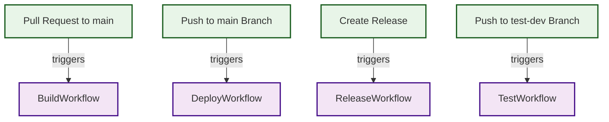
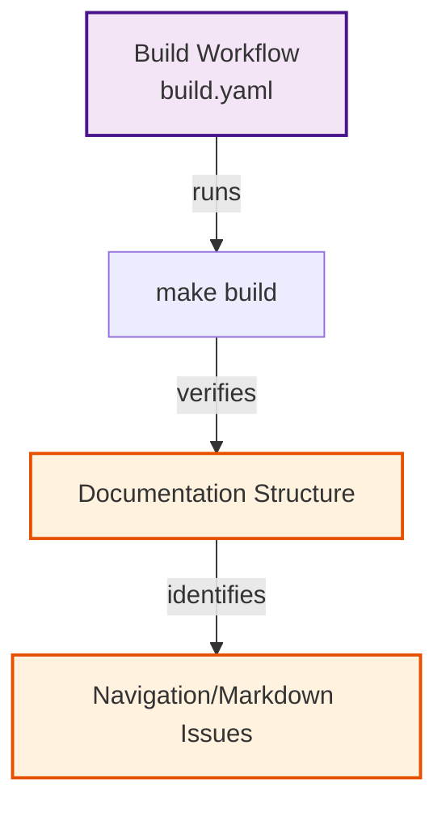
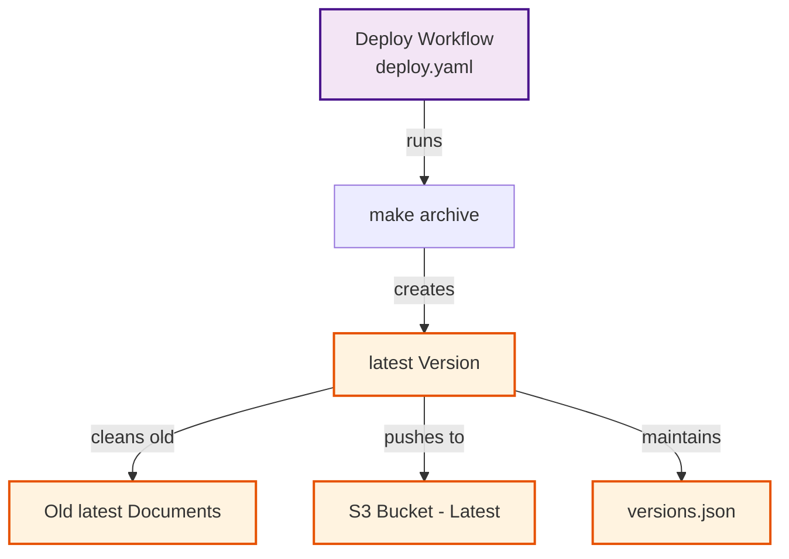
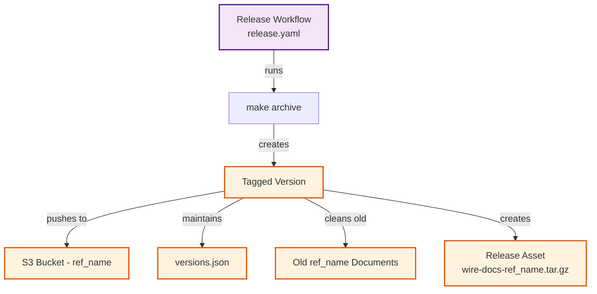
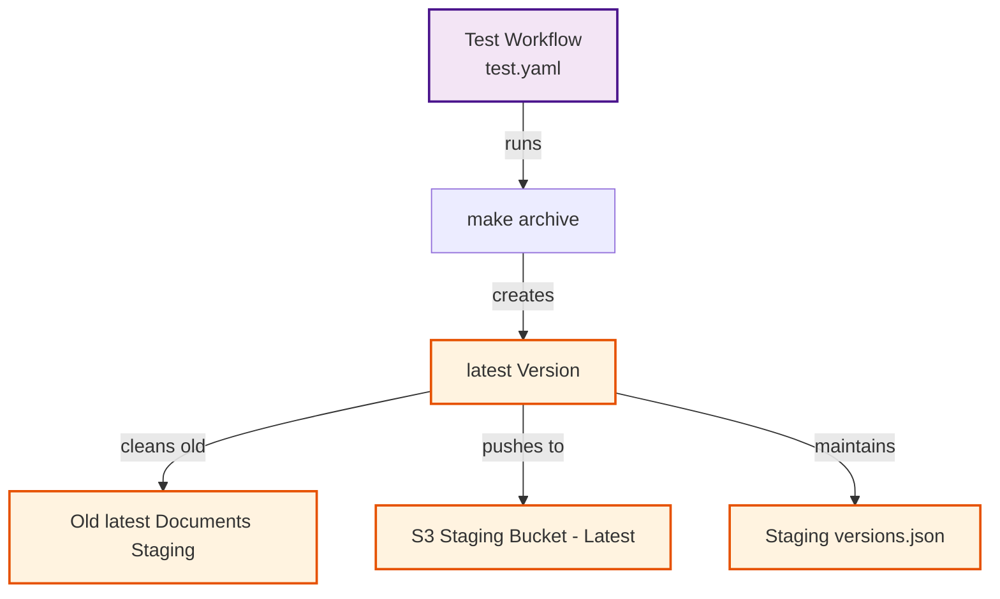

# Wire-documents-structure

Wire documentation is hosted on <https://docs.wire.com>. This project uses MkDocs as its documentation generator.

## Structure of the repository
### src Directory
Contains the source files and directories for the documentation. The `src` directory has been migrated from the [wire-server docs](https://github.com/wireapp/wire-server/tree/develop/docs). The previous version used Sphinx, so we converted it to Markdown and adapted it for MkDocs. See `build/old-docs.md` for the migration process.

### External Pages (Git Submodules)
We import documentation pages from the backend repository [wire-server](https://github.com/wireapp/wire-server/tree/develop). Many files currently reference wire-server, which you can identify using:

```bash
find . -type l -printf '%p -> %l\n' | grep './src'
```

#### Submodule Management

**Fetch latest updates from wire-server:**
```bash
git submodule update --remote --checkout --depth 1 -- wire-server
```
*Note: Only run this command when the remote repository has new changes.*

**Checkout a specific commit:**
```bash
cd wire-server && git fetch --depth=1 origin <commit-id> && git checkout <commit-id>
```

**Verify submodule status:**
```bash
git submodule status
```

**Update changelog (optional):**
To optionally update the src/changelog/README.md based on the new changelog.md, run the following command:

``` bash
rm src/changelog/README.md && \
grep '^# ' src/changelog/changelog.md | \
sed 's/^# //' | while IFS= read -r heading; \
do anchor=$(echo "$heading" | sed -E 's/^\[?([0-9-]+)\]? *(\(([^)]+)\)|# *([0-9]+))$/\1-\3\4/' | tr '[:upper:]' '[:lower:]' | sed 's/ /-/g;s/\.//g'); echo "* [$heading](changelog.md#$anchor)"; done > src/changelog/README.md
```

### build Directory
Contains scripts used by the Makefile to support different build use cases. The system is designed to run one build process at a time. All local targets use a temporary directory (stored in `.tmpdir` file) for building and serving changes due to git operations required by tools like `mike` for MkDocs.

## Prerequisites

- make
- nix-shell
- git
- rsync
- Docker (optional) - for building Docker images when testing without nix-shell

## Makefile Targets

### `make current`
Runs the documentation site locally using Mike (MkDocs plugin) for the `current` branch only. Current changes appear under the branch name as the version name. Hosted at `0.0.0.0:8000`.

### `make run`
Serves the documentation site locally by building the current branch as static web pages, then hosts a web server using Python's HTTP module. This allows you to preview how the documentation will appear when hosted for the current branch. Hosted at `0.0.0.0:8000`.

### `make archive`
Archives the processed web pages for the current branch from the GitHub `gh-pages` branch (created by `make build`). Output is generated in the main directory as `wire-docs.tar.gz`.

### `make build`
Used by `run` and `archive` targets to build the current branch. Attempts to identify the version name for the environment. In GitHub environments, it finds an appropriate name for the version to be built instead of using a branch name.

### `make docker` *(Experimental)*
Builds a Docker image for the documentation using the repository's Dockerfile. Uses Python's `mike` module to host documents (experimental - not the standard Python HTTP module). For testing current changes, use `make run` or `make current` instead.

To test the Docker image locally:
```bash
docker run -d -p 8000:8000 --restart=always --health-cmd="curl --fail http://localhost:8000 || exit 1" --health-interval=30s --health-retries=3 --health-timeout=5s wire-docs
```

### `make clean`
Cleans up generated tar files and temporary directories from the build process.

### Verbose Mode
For increased verbosity in make commands:
```bash
make SHELL="/bin/bash -x" target
```

## GitHub Actions for Build and Deployment



The repository includes four automated builds:

### 1. [Build Test](.github/workflows/build.yaml)
Runs `make build` to verify MkDocs build structure for each pull request.




### 2. [Prod Env Latest Build and Deploy to S3](.github/workflows/deploy.yaml)
Runs `make archive` on every push to the main branch as the `latest` version. Cleans old `latest` documents before uploading to ensure the S3 bucket matches the main branch state. Maintains `versions.json` (tracking all document versions) without overwriting, keeping it synchronized with the latest version with commit as an alias.



### 3. [Build, Deploy and Release Artifact](.github/workflows/release.yaml)
Runs `make archive` when creating new releases, using the git tag (ref_name) as the version. Follows the same cleaning and S3 management process as the production deployment. Creates a release asset equivalent to the `make archive` output for that git tag.



### 4. [Test Environment Build and S3 Deploy](.github/workflows/test.yaml)
Tests the above operations in a staging bucket environment.



## Versioning System

### Version Format
Version numbers follow a three-part format: **A.B.C**

- **A (Major Version)**: Indicates the minimum API contract version supported by this release. When this increases, it signals deprecation of older API contract versions. For example, V5.0.0 supports API V5 and newer. Major versions may include breaking changes such as database migrations or backend service structure changes.

- **B (Feature Iteration)**: Reflects feature updates that don't affect API contract compatibility or introduce breaking changes. For example, V5.1.0 supports API V5 and newer while adding new features or improvements without altering compatibility.

- **C (Fix Iteration)**: Incremented for bug fixes or security updates that don’t introduce new features or modify compatibility. Fix iterations contain no breaking changes.

**Note**: The first release, `v0.0.0`, indicates that the documentation supports all API versions.

## Version and Tag Relationship

## Relationship Between Versions and Tags:
- We provide multiple documentation versions, with each version corresponding to a specific release in the wire-docs repository.

- Releases are based on Git tags, which mark a specific point in your repository's history.

- Once a version or tag is released, it becomes immutable. Future updates require creating new versions—no further edits are permitted on existing tags.

-The latest version is regularly updated based on commits to the main branch.
