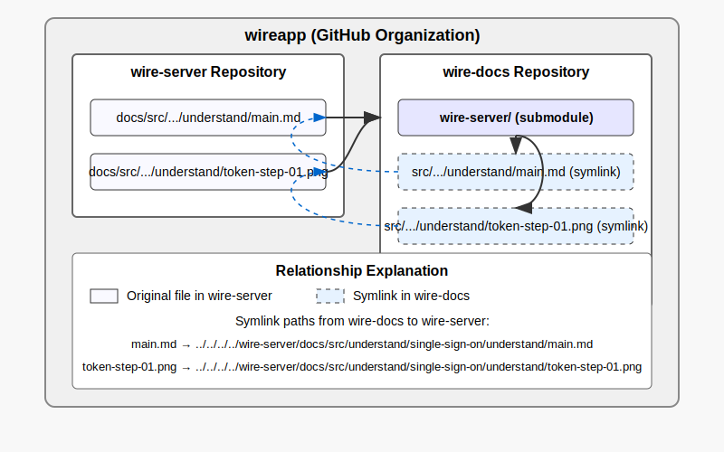
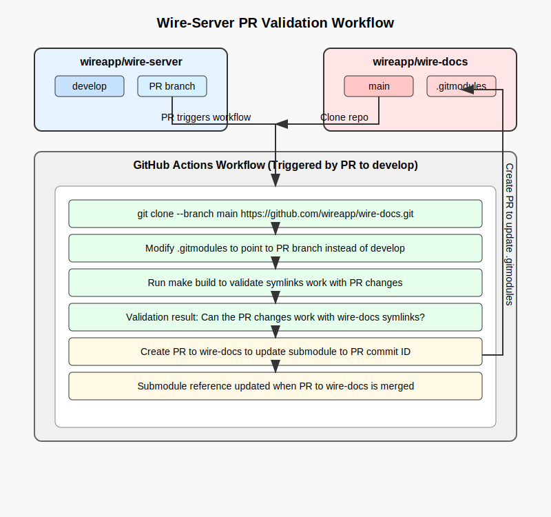

# Linking pages from wire-server to wire-docs
- Create a documentation '/docs' directory in your repository for eg. `wire-server` and add your markdown documentation files there.
- The '/docs' files will be included (as linked files) in the `wire-docs` repository via a submodule and will be pulled during the build process.
- The submodule management documentation can be at [Submodule Management](../../README.md#submodule-management)

*Note: The further instructions will refer to `wire-server` as the example repository containing the documentation files, but the same applies to any other repository like `wire-apps-jvm-sdk`. Feel free to include these instructions in your own repository's documentation.*

## Example Diagram


- The Markdown (.md) pages in the docs directory should be self-contained, including any static images or diagrams. However, please note that links within these documents may not function correctly, as they are relative to the `wire-docs/src` directory due to the symlink structure. To ensure that document links work as intended, collaborate with the `wire-docs` repository to identify their correct locations.

## Understanding the Repository Structure
- **wire-docs**: Main documentation repository
- **wire-server/docs**: Documentation related to the documentation pages in the `wire-server` (the submodule) repository. 

## Update Operations

### Editing Existing Pages

**For content in wire-server/docs:**
1. Make changes directly in the `wire-server/docs` directory
2. Create a PR against the `wire-server:develop` branch.
*Note: The `develop` branch is specific to `wire-server`. Other repositories may have different branch names, such as `main` for `wire-apps-jvm-sdk`.*
3. Once merged, these changes will be picked up by `wire-docs` through submodule updates.
4. In `wire-docs`:
   - Update the `wire-server` submodule (to the latest commit) and commit that change
   - Test with `make run` before creating a PR

**For content only in wire-docs:**
1. Make changes directly in `wire-docs/src`
2. Create a PR against `wire-docs:main` branch

### Moving Pages from wire-docs/src to wire-server/docs

When a page needs to be moved because it's related to code changes in your repository (e.g., `wire-server`), follow these steps:
1. Add the page to `wire-server/docs` and merge it to the develop branch.
2. In `wire-docs`:
   - Update the `wire-server` submodule (to the latest commit) and commit that change
   - Delete the original page from `wire-docs/src`
   - Create a relative symbolic link to the file in the `wire-server` module:
     ```
     cd src/developer/reference/
     rm example-file.svg
     ln -s ../../../wire-server/docs/src/developer/reference/example-file.svg example-file.svg
     ```
3. Commit new linked files before testing with `make run`
4. Test with `make run` before creating a PR

## Creating New Files

### For content related to wire-server:
1. Create the file in `wire-server/docs`
2. Merge it into `wire-server:develop`
3. To make it discoverable on docs.wire.com:
   - Update the `wire-server` submodule reference in `wire-docs` and commit the change
   - Create a relative symbolic link to the file in the `wire-server` module:
     ```
     cd src/developer/reference/
     ln -s ../../../wire-server/docs/src/developer/reference/example-file.svg example-file.svg
     ```
   - Commit new linked files before testing with `make run`
   - Update the navigation structure in [mkdocs.yml](https://github.com/wireapp/wire-docs/blob/main/mkdocs.yml#L9) or update the directory's README.md to include references to the new file, or add references to the new file from relevant existing pages
   - Test with `make run` and create a PR to `wire-docs:main`

### For content not related to wire-server:
1. Add the page to `wire-docs/src` in the appropriate location
2. Update the navigation structure in [mkdocs.yml](https://github.com/wireapp/wire-docs/blob/main/mkdocs.yml#L9) or update the directory's README.md to include references to the new file, or add references to the new file from relevant existing pages 
3. Test with `make run` and create a PR to `wire-docs:main`

## Removing Files

### Removing files from wire-server/docs:
1. Identify all references to the file in `wire-server/docs` and `wire-docs`
2. Remove all references and links from navigation (mkdocs.yml) and other pages
3. Delete the file from its location in `wire-server/docs` and merge to `wire-server:develop`
4. Update the `wire-server` submodule reference in `wire-docs` and commit the change
5. Delete the symlink from `wire-docs/src`
6. Commit local deleted files before testing with `make run`
7. Submit a PR to `wire-docs:main`

### Removing files from wire-docs:
1. Identify all references to the file in `wire-docs` and `wire-server/docs`
2. Remove all references and links from navigation (mkdocs.yml) and other pages.
3. Update the submodule reference in `wire-docs` if the file is linked from a submodule.
4. Delete the file from its location
5. Commit local deleted files before testing with `make run`
6. Submit a PR to `wire-docs:main`

## Publishing Changes

All changes to documentation go live when the [Prod Env Latest Build and Deploy to S3](https://github.com/wireapp/wire-docs/blob/main/.github/workflows/deploy.yaml) workflow on `wire-docs` runs post merging the PR on `wire-docs:main`. Currently, submodule updates from `wire-server` to `wire-docs` are performed manually, but there are plans to automate this with a pipeline in the very near future.

## Automated Validation Workflow on PRs to wire-server for Documentation Changes:
- Since `wire-docs` works with multiple repositories, it's crucial to ensure that documentation changes in each submodule like `wire-server` are compatible with the symlink structure in `wire-docs`. To achieve this, we have implemented an automated validation workflow using GitHub Actions.

- Create a workflow that automates documentation validation between the `wire-server` and `wire-docs` repositories like mentioned in [build workflow](build.yaml).
    
- When a PR is made to `wire-server`'s `develop` branch, GitHub Actions clones `wire-docs` and temporarily modifies its .gitmodules to point to the PR branch instead of `develop`. It then runs a build process to validate that the documentation changes work correctly with `wire-docs` symlink structure.
- If the build succeeds, the PR can be merged. If it fails, the PR author must address the issues before merging.



## Post-Merge Process
- After merging the PR in `wire-server`, a second PR is created in `wire-docs` to update the submodule reference to the latest commit in `wire-server`. This PR is then verified by [Build Test](https://github.com/wireapp/wire-docs/blob/main/.github/workflows/build.yaml) workflow and can be merged if successful.
