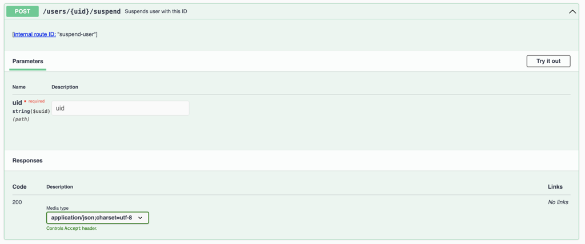

<a id="suspend-users"></a>

# Suspending and unsuspending users

Suspending a user ends every session that user currently has, on every device, and blocks any further logins — without deleting the account. It is fully reversible: the account, its handle, its conversations and its assets all stay in place, and unsuspending restores access.

This is normally what you want when access has to be cut off quickly and you are not (yet) ready to [permanently delete the user](users.md#user-deletion): a lost or stolen device, a departure that is still being disputed, or an account under investigation.

This page requires that you have root access to the machines where kubernetes runs on, or have kubernetes permissions allowing you to port-forward arbitrary pods and services.

## Suspend or delete?

|                               | Suspend                            | Delete                              |
|-------------------------------|------------------------------------|-------------------------------------|
| Existing sessions             | Revoked immediately                | Revoked                             |
| Further logins                | Blocked                            | Impossible                          |
| Profile, name, email          | Retained                           | Purged                              |
| Handle (unique username)      | Stays reserved by the account      | Released                            |
| Conversations and assets      | Retained                           | Deleted                             |
| Appears in search             | No                                 | No                                  |
| Reversible                    | Yes                                | No                                  |

If you need the account gone for good, use [Deleting a user which is not a team user](users.md#user-deletion) instead.

<a id="what-suspension-does"></a>

## What happens when a user is suspended

Suspension is a change to the account's `status` field, from `active` to `suspended`. When brig applies that change it:

- revokes all of the user's cookies, which ends the session on every client the user is logged in on;
- rejects any subsequent login attempt for that account;
- emits a `user.suspended` event;
- updates the search index, so the user stops appearing in search results.

Unsuspending sets `status` back to `active` and emits a `user.resumed` event. Cookies are *not* restored — the user has to log in again, which they are now able to do.

#### WARNING
Suspension takes effect immediately and will interrupt ongoing calls and message delivery for that user. If you are suspending a large number of accounts, time it accordingly.

#### NOTE
Only `active` and `suspended` can be set this way. The remaining account statuses (`deleted`, `ephemeral`, `pending-invitation`) are rejected by the endpoint, because they are set by other parts of the system as part of deletion, guest accounts and team invitations.

<a id="find-the-user-id"></a>

## Finding the user ID

Every command below needs the user's ID (a UUID). If you only have an email address or a handle, look the user up first, as described in [Manually searching for users in cassandra](users.md#manually-searching-for-users-in-cassandra).

The same output also carries the current `status`, so it doubles as a check of where the account stands before you change anything:

```json
[
   {
      "status" : "active",
      "name" : "somename",
      "email" : "user@example.com",
      "id" : "9122e5de-b4fb-40fa-99ad-1b5d7d07bae5",
      "handle" : "user123"
   }
]
```

Double-check that the `id` you are about to act on really is the user you mean.

#### NOTE
Do not use `UID` as your shell variable name for this. `UID` is read-only in bash and the assignment will fail. The examples below use `USER_ID`.

<a id="suspend-a-user"></a>

## Suspending a user

Suspension is applied through brig's internal `status` endpoint.

Terminal one:

```sh
kubectl port-forward svc/brig 9999:8080
```

Terminal two: set the status to `suspended`.

```sh
# replace the id with the id of the user you want to suspend
USER_ID=9122e5de-b4fb-40fa-99ad-1b5d7d07bae5
curl -v -XPUT localhost:9999/i/users/$USER_ID/status \
  -H 'Content-Type: application/json' \
  -d '{"status":"suspended"}'
```

A successful call returns `200` with an empty body. The user is signed out of all clients straight away.


#### NOTE
We use two terminals in this step, one for openining your connection to brig, and the other for talking to brig. Opening the connection to brig is required for suspending, unsuspending, and verifying suspension, but is not repeated in the next two sections. Please ensure you close your kubectl command when you are done accessing the Wire cluster.

<a id="unsuspend-a-user"></a>

## Unsuspending a user

To restore access, set the status back to `active`, using the same port-forward:

```sh
USER_ID=9122e5de-b4fb-40fa-99ad-1b5d7d07bae5
curl -v -XPUT localhost:9999/i/users/$USER_ID/status \
  -H 'Content-Type: application/json' \
  -d '{"status":"active"}'
```

The user can log in again immediately, but will have to sign in again from scratch: suspension has revoked their cookies and unsuspending does not bring them back.

<a id="verify-suspension"></a>

## Verifying the result

Brig reports the current status of a single account:

```sh
curl -s localhost:9999/i/users/$USER_ID/status | json_pp
```

Which returns:

```json
{
   "status" : "suspended"
}
```

You can also confirm from the user's side: a suspended user is signed out of all clients, and an attempt to log in fails rather than returning an access token.

<a id="suspend-script"></a>

## Doing it with a script

For repeated use, the following script wraps the endpoint above. It resolves an email address to a user ID, shows the current status, asks for confirmation, and prints the status afterwards.

Save it as `suspend_user.sh` and make it executable with `chmod +x suspend_user.sh`. It needs `curl` and [jq](https://jqlang.github.io/jq/).

```sh
#!/usr/bin/env bash
# Suspend or unsuspend a Wire user via brig's internal API.
# Requires a port-forward to brig, e.g.:
#   kubectl port-forward svc/brig 9999:8080

set -euo pipefail

BRIG_HOST="http://localhost:9999"
ACTION=""
USER_ID=""
EMAIL=""

usage() {
    cat <<EOF
Usage: $0 -a <suspend|unsuspend|status> [-u <user id>] [-e <email>] [-b <brig host>]

  -a  Action to perform: suspend, unsuspend, or status (read-only).
  -u  User ID (UUID) to act on.
  -e  Email address to look up, instead of passing -u.
  -b  Base URI of brig's internal endpoint. Default: ${BRIG_HOST}
EOF
    exit 1
}

while getopts "a:u:e:b:" opt; do
    case "$opt" in
        a) ACTION="$OPTARG" ;;
        u) USER_ID="$OPTARG" ;;
        e) EMAIL="$OPTARG" ;;
        b) BRIG_HOST="$OPTARG" ;;
        *) usage ;;
    esac
done

[ -n "$ACTION" ] || usage
[ -n "$USER_ID" ] || [ -n "$EMAIL" ] || usage

case "$ACTION" in
    suspend)   NEW_STATUS="suspended" ;;
    unsuspend) NEW_STATUS="active" ;;
    status)    NEW_STATUS="" ;;
    *)         usage ;;
esac

# Resolve the email address to a user ID, if one was given.
if [ -z "$USER_ID" ]; then
    USER_ID=$(curl -sS -G "${BRIG_HOST}/i/users" \
        --data-urlencode "email=${EMAIL}" | jq -r '.[0].id // empty')
    if [ -z "$USER_ID" ]; then
        echo "No user found for ${EMAIL}" >&2
        exit 1
    fi
    echo "Resolved ${EMAIL} to ${USER_ID}"
fi

CURRENT=$(curl -sS "${BRIG_HOST}/i/users/${USER_ID}/status" | jq -r .status)
echo "Current status of ${USER_ID}: ${CURRENT}"

[ -n "$NEW_STATUS" ] || exit 0

if [ "$CURRENT" = "$NEW_STATUS" ]; then
    echo "Already ${NEW_STATUS}, nothing to do."
    exit 0
fi

read -r -p "Set ${USER_ID} to ${NEW_STATUS}? [y/N] " CONFIRM
case "$CONFIRM" in
    y|Y) ;;
    *) echo "Aborted." >&2; exit 1 ;;
esac

BODY=$(mktemp)
trap 'rm -f "$BODY"' EXIT

HTTP_CODE=$(curl -sS -o "$BODY" -w '%{http_code}' \
    -XPUT "${BRIG_HOST}/i/users/${USER_ID}/status" \
    -H 'Content-Type: application/json' \
    -d "{\"status\":\"${NEW_STATUS}\"}")

case "$HTTP_CODE" in
    2*) ;;
    *)  echo "Request failed (HTTP ${HTTP_CODE}):" >&2
        cat "$BODY" >&2
        exit 1 ;;
esac

echo "New status: $(curl -sS "${BRIG_HOST}/i/users/${USER_ID}/status" | jq -r .status)"
```

Typical usage, with the port-forward from the previous section running in another terminal:

```sh
# check where an account stands
./suspend_user.sh -a status -e user@example.com

# suspend, by email
./suspend_user.sh -a suspend -e user@example.com

# unsuspend, by user ID
./suspend_user.sh -a unsuspend -u 9122e5de-b4fb-40fa-99ad-1b5d7d07bae5
```

<a id="suspend-via-backoffice"></a>

## Alternative: the backoffice pod

Most installations do not have `backoffice` deployed, so the steps above are the general route. If you do happen to have it installed, it wraps the same operation behind a pair of dedicated endpoints, `POST /users/{uid}/suspend` and `POST /users/{uid}/unsuspend`, which you can call from its Swagger UI or with `curl` after a port-forward to `svc/backoffice`:



These call brig's `PUT /i/users/{uid}/status` internally, so the effect is exactly the same as the commands above. See the [backoffice README](https://github.com/wireapp/wire-server/tree/develop/charts/backoffice) for details.

<a id="suspension-caveats"></a>

## Things to be aware of

### SCIM-provisioned users

For teams provisioned over SCIM, the account status is derived from the SCIM `active` attribute, and the SCIM client is the source of truth. Suspending such a user directly on the backend works, but the next SCIM update from the identity provider can set the account back to `active`. For SCIM-managed teams, deactivate the user in the identity provider instead. See [Single Sign-On and User Provisioning](../../understand/single-sign-on/README.md).

### Suspending a whole team

The endpoints on this page act on a single user. Suspending an entire team is a separate operation on brig, which suspends the team and all of its members. It uses the same port-forward:

```sh
TEAM_ID=123e4567-e89b-12d3-a456-426614174000
curl -v -XPOST localhost:9999/i/teams/$TEAM_ID/suspend
curl -v -XPOST localhost:9999/i/teams/$TEAM_ID/unsuspend
```

### Access to these endpoints

Brig's internal API is an administrative interface with no authentication of its own. It must not be exposed publicly; reaching it through `kubectl port-forward`, as above, keeps it inside the cluster. Restrict who holds the kubernetes permissions that make these steps possible.

### Cookies and suspension are separate mechanisms

Suspension revokes the affected user's cookies as a side effect. If your goal is only to force users to sign in again — for example after a security event — and not to block them, see [Reset session cookies](users.md#reset-session-cookies) instead.
