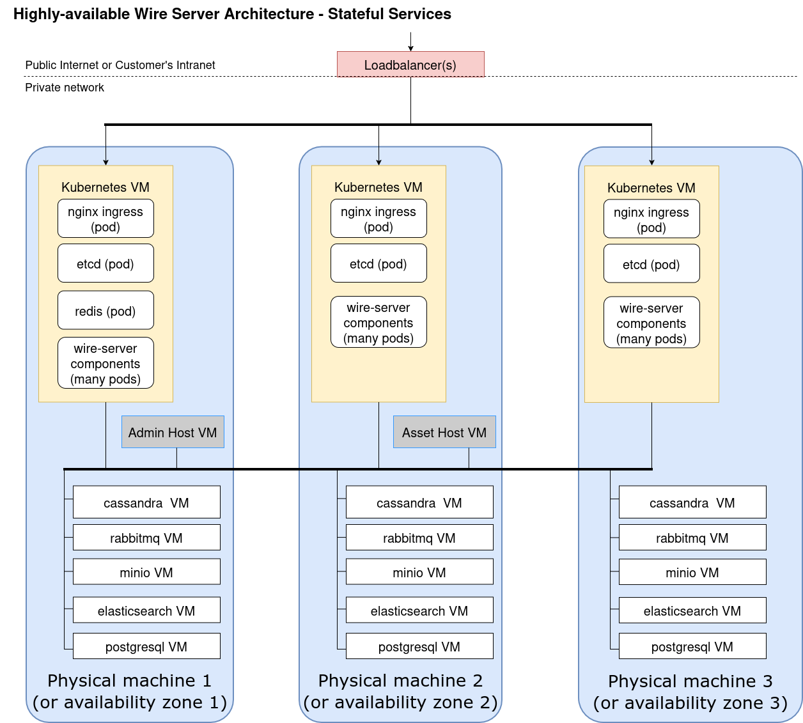
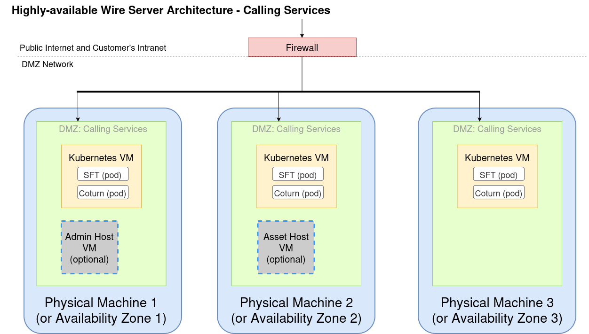

# Installing kubernetes and databases on VMs with ansible

## Introduction

In a production environment, some parts of the wire-server infrastructure (such as e.g. Cassandra, PostgresSQL, RabbitMQ, Minio etc databases) are best configured outside kubernetes. Additionally, kubernetes can be rapidly set up with kubespray, via ansible. This section covers installing k8s services and databases with ansible.

Please ensure that we have created VMs as per the [production architecture](planning.md#production-installation-persistent-data-high-availability), we would be using this information in the next step of creating inventory.



## Downloading and extracting the artifact

Create a fresh workspace to download the artifacts:

```bash
$ cd ...  # you pick a good location!
```
Obtain the latest airgap artifact for wire-server-deploy. Please contact us to get it.

Extract the above listed artifacts into your workspace:

```bash
$ wget https://s3-eu-west-1.amazonaws.com/public.wire.com/artifacts/wire-server-deploy-static-<HASH>.tgz
$ tar xvzf wire-server-deploy-static-<HASH>.tgz
```
Where `<HASH>` above is the hash of your deployment artifact, given to you by Wire, or acquired by looking at the above build job.
Extract this tarball.

Make sure that the admin host can `ssh` into all the machines that you want to provision. Our [docker container](dependencies.md#making-tooling-available-in-your-environment) will use the `.ssh` folder and the `ssh-agent` of the user running the scripts.

There's also a docker image containing the tooling inside this repo.

## Editing the inventory

Copy [ansible/inventory/offline/99-static](https://github.com/wireapp/wire-server-deploy/blob/master/ansible/inventory/offline/99-static)  to `ansible/inventory/offline/hosts.ini`, and backup the original.

```bash
cp ansible/inventory/offline/99-static ansible/inventory/offline/hosts.ini
mv ansible/inventory/offline/99-static ansible/inventory/offline/orig.99-static
```

Edit `ansible/inventory/offline/hosts.ini`. Here, you will describe the topology of your offline deploy as explained in the next section.

Add one entry in the `all` section of this file for each machine you are managing via ansible. This will be all of the machines in your Wire cluster.

If you are using username/password to log into and sudo up, in the `all:vars` section, add:
```ini
ansible_user=<USERNAME>
ansible_password=<PASSWORD>
ansible_become_pass=<PASSWORD>
```

> Note: Make sure that `assethost` is present in the inventory file with the correct `ansible_host` (and `ip` values if required)

### Updating Database Group Memberships
It's recommended to update the lists of what nodes belong to which group, so ansible knows what to install on these nodes.

These sections can be divided into individual host groups, reflecting the architecture of the target infrastructure. Examples with individual nodes for Elastic, MinIO, PostgreSQL, RabbitMQ and Cassandra are commented out below.
```ini
[elasticsearch]
elasticsearch1
elasticsearch2
elasticsearch3

[minio]
minio1
minio2
minio3

[cassandra]
cassandra1
cassandra2
cassandra3

[cassandra_seed]
cassandraseed1

[postgresql]
postgresql1
postgresql2
postgresql3

[postgresql_rw]
postgresql1

[postgresql_ro]
postgresql2
postgresql3

[rmq-cluster]
rabbitmq1
rabbitmq2
rabbitmq3

```

### Configuring kubernetes and etcd

To run Kubernetes, at least three nodes are required, which need to be added to the `[kube-master]`, `[etcd]`  and `[kube-node]` groups of the inventory file. Any additional nodes should only be added to the `[kube-node]` group, for example:

```ini
[kube-master]
kubemaster1
kubemaster2
kubemaster3

[etcd]
etcd1 etcd_member_name=etcd1
etcd2 etcd_member_name=etcd2
etcd3 etcd_member_name=etcd3

[kube-node]
prodnode1
prodnode2
prodnode3
prodnode4
```

### Setting up databases and kubernetes to talk over the correct (private) interface
If you are deploying wire on servers that are expected to use one interface to talk to the public, and a separate interface to talk amongst themselves, you will need to add "ip=" declarations for the private interface of each node. for instance, if the first kubenode was expected to talk to the world on 192.168.122.21, but speak to other wire services (kubernetes, databases, etc) on 192.168.0.2, you should edit its entry like the following:
```
kubenode1 ansible_host=192.168.122.21 ip=192.168.0.2
```
Repeat this for all of the instances.

### Setting up Database network interfaces and service specific variables:
- Make sure that `cassandra_network_interface` is set to the name of the network interface on which the kubenodes should talk to cassandra and on which the cassandra nodes should communicate among each other. Run `ip addr` on one of the cassandra nodes to determine the network interface names, and which networks they correspond to. In Ubuntu 22.04 for example, interface names are predictable and individualized, eg. `enp41s0`.
- Similarly `elasticsearch_network_interface`, `rabbitmq_network_interface`, `postgresql_network_interface` and `minio_network_interface` should be set to the network interface names to the service specific groups to ensure communicatation with kubernetes and among each other.
- RabbitMQ requires the variable `rabbitmq_cluster_master` to configure one of the `rmq-cluster` nodes as master.
- PostgreSQL requires following variables to define the database topology and database to create:
```ini
wire_dbname= wire-server
repmgr_node_config = {"postgresql1": {"node_id": 1, "priority": 150, "role": "primary"}, "postgresql2": {"node_id": 2, "priority": 100, "role": "standby"}, "postgresql3": {"node_id": 3, "priority": 50, "role": "standby"}}
```
- In an INI inventory, the `repmgr_node_config` keys must match the PostgreSQL inventory hostnames.
- To read more about specific PostgreSQL configuration, reat at [PostgreSQL High Availability Cluster - Quick Setup](../administrate/postgresql-cluster.md).

### Example hosts.ini

Here is an example hosts.ini file for the primary k8s cluster and database services.

```ini
[all:vars]
ansible_user=<USERNAME>
ansible_password=<PASSWORD>
ansible_become_pass=<PASSWORD>

[assethost]
assethost ansible_host=10.1.1.1

[cassandra]
cassandra1 ansible_host=10.1.1.17
cassandra2 ansible_host=10.1.1.2
cassandra3 ansible_host=10.1.1.16

[cassandra:vars]
cassandra_network_interface=enp7s0

[cassandra_seed]
cassandra3

[elasticsearch]
elasticsearch1 ansible_host=10.1.1.9
elasticsearch2 ansible_host=10.1.1.15
elasticsearch3 ansible_host=10.1.1.19

[elasticsearch:vars]
elasticsearch_network_interface=enp7s0

[elasticsearch_master:children]
elasticsearch

[kube-node]
kubenode1 ansible_host=10.1.1.3 etcd_member_name=kubenode1 ip=10.1.1.3
kubenode2 ansible_host=10.1.1.4 etcd_member_name=kubenode2 ip=10.1.1.4
kubenode3 ansible_host=10.1.1.8 etcd_member_name=kubenode3 ip=10.1.1.8

[kube-master:children]
kube-node

[etcd:children]
kube-master

[k8s-cluster:children]
kube-master
kube-node

[k8s-cluster:vars]
calico_mtu=1450
calico_veth_mtu=1430

[minio]
minio1 ansible_host=10.1.1.6
minio2 ansible_host=10.1.1.7
minio2 ansible_host=10.1.1.20

[minio:vars]
minio_network_interface=enp7s0

[postgresql]
postgresql1 ansible_host=10.1.1.11
postgresql2 ansible_host=10.1.1.5
postgresql3 ansible_host=10.1.1.12

[postgresql:vars]
postgresql_network_interface=enp7s0
wire_dbname=wire-server
repmgr_node_config={"postgresql1":{"node_id":1,"priority":150,"role":"primary"},"postgresql2":{"node_id":2,"priority":100,"role":"standby"},"postgresql3":{"node_id":3,"priority":50,"role":"standby"}}

[postgresql_ro]
postgresql2
postgresql3

[postgresql_rw]
postgresql1

[rmq-cluster]
rabbitmq1 ansible_host=10.1.1.18
rabbitmq2 ansible_host=10.1.1.13
rabbitmq3 ansible_host=10.1.1.14

[rmq-cluster:vars]
rabbitmq_cluster_master=rabbitmq3
rabbitmq_network_interface=enp7s0
```

## Generating random secrets for the services

Minio and coturn services have shared secrets with the `wire-server` helm chart. Run the folllowing script that generates a fresh set of secrets for these components:

```bash
./bin/offline-secrets.sh
```

This should generate 3 secret files as:
- `./ansible/inventory/group_vars/all/secrets.yaml` - This file will be used by ansible playbooks to configure service secrets.
- `values/wire-server/secrets.yaml` - This contains the secrets for Wire services and share some secrets from coturn and database services.
- `values/coturn/secrets.yaml` - This contains a secret for the coturn service.

Read more secrets management at [Secrets Overview for Wire Deployments](secrets-overview.md).

## Deploying Kubernetes and stateful services

In order to deploy all mentioned services, run:
```
d ./bin/offline-cluster.sh
```

This wrapper runs the following Ansible playbooks in order:

1. `d ansible-playbook -i ansible/inventory/offline/hosts.ini ansible/setup-offline-sources.yml`: prepares the `assethost`, copies offline artifacts, and configures the other hosts to fetch packages and images from it.
2. `d ansible-playbook -i ansible/inventory/offline/hosts.ini ansible/kubernetes.yml --tags bastion,bootstrap-os,preinstall,container-engine`: runs the first Kubernetes bootstrap phase so the container runtime is ready.
3. `d ansible-playbook -i ansible/inventory/offline/hosts.ini ansible/seed-offline-containerd.yml`: loads the offline container images onto the nodes after the runtime is available.
4. `d ansible-playbook -i ansible/inventory/offline/hosts.ini ansible/sync_time.yml -v`: installs and configures time synchronization before the rest of the cluster comes up.
5. `d ansible-playbook -i ansible/inventory/offline/hosts.ini ansible/kubernetes.yml --skip-tags bootstrap-os,preinstall,container-engine,multus`: finishes the remaining Kubernetes deployment after the prerequisites are in place.
6. `d ansible-playbook -i ansible/inventory/offline/hosts.ini ansible/cassandra.yml`: deploys the Cassandra nodes.
7. `d ansible-playbook -i ansible/inventory/offline/hosts.ini ansible/elasticsearch.yml`: deploys Elasticsearch.
8. `d ansible-playbook -i ansible/inventory/offline/hosts.ini ansible/minio.yml`: deploys MinIO.
9. `d ansible-playbook -i ansible/inventory/offline/hosts.ini ansible/postgresql-deploy.yml`: deploys the PostgreSQL cluster.
10. `d ansible-playbook -i ansible/inventory/offline/hosts.ini ansible/roles/rabbitmq-cluster/tasks/configure_dns.yml`: prepares DNS entries required by the RabbitMQ cluster.
11. `d ansible-playbook -i ansible/inventory/offline/hosts.ini ansible/rabbitmq.yml`: deploys RabbitMQ.
12. `d ansible-playbook -i ansible/inventory/offline/hosts.ini ansible/helm_external.yml`: writes the external service IPs into the Helm values files so the charts can target those services. This step is a [pre-requiste](#installing-helm-charts---prerequisites) before continuing with helm operations.

The order matters: offline package sources and container runtime must be ready before image seeding, time sync should happen before the cluster stabilizes, Kubernetes must exist before the rest of the platform is wired around it, and `helm_external.yml` comes last because it depends on the database and messaging nodes already being deployed.

If one step fails and you want to run the playbooks manually, use the `d` alias shown above and execute the specific command directly in the same order.

### Ensuring Kubernetes is healthy.

Ensure the k8s cluster comes up healthy. The container also contains `kubectl`, so check the node status:

```bash
d kubectl get nodes -owide
```
They should all report ready.

### Troubleshooting external services
Cassandra, Minio, PostgresSQL, RabbitMQ and Elasticsearch are running outside Kubernets cluster, make sure those machines have necessary ports open -

On each of the machines running Cassandra, Minio, PostgresSQL, RabbitMQ and Elasticsearch, run the following commands to open the necessary ports, if needed:
```bash
sudo bash -c '
set -eo pipefail;

# cassandra
ufw allow 9042/tcp;
ufw allow 9160/tcp;
ufw allow 7000/tcp;
ufw allow 7199/tcp;

# elasticsearch
ufw allow 9300/tcp;
ufw allow 9200/tcp;

# minio
ufw allow 9000/tcp;
ufw allow 9092/tcp;

#rabbitmq
ufw allow 5671/tcp;
ufw allow 5672/tcp;
ufw allow 4369/tcp;
ufw allow 25672/tcp;

#postgresql
ufw allow 5432/tcp;
'
```

## Deploying secondary k8s cluster for calling services

Now we are done with configuring primary k8s cluster and databases. Now, we would be installing a secondary k8s cluster.



### Marking kubenodes for calling servers (SFT/Coturn)

The SFT & Coturn Calling server should be running on a kubernetes nodes that are connected to the public internet. If not all kubernetes nodes match these criteria, you should specifically label the nodes that do match these criteria, so that you're sure SFT is deployed correctly.

By using a `node_label` you can make sure SFT & Coturn are only deployed on certain nodes like `call_kubenode1` & `call_kubenode2`:

```ini
[all:vars]
ansible_user=<USERNAME>
ansible_password=<PASSWORD>
ansible_become_pass=<PASSWORD>

[assethost]
assethost ansible_host=10.1.1.1

[kube-node]
call_kubenode1  ansible_host=10.1.1.33 etcd_member_name=call_kubenode1 ip=10.1.1.33 node_labels="{'wire.com/role': 'sftd'}" node_annotations="{'wire.com/external-ip': 'a.b.c.d'}"
call_kubenode2 ansible_host=10.1.1.34 etcd_member_name=call_kubenode2 ip=10.1.1.34 node_labels="{'wire.com/role': 'coturn'}""
call_kubenode3 ansible_host=10.1.1.36 etcd_member_name=call_kubenode3 ip=10.1.1.36

[kube-master:children]
kube-node

[etcd:children]
kube-master

[k8s-cluster:children]
kube-master
kube-node

[k8s-cluster:vars]
calico_mtu=1450
calico_veth_mtu=1430
```

If the node does not know its onw public IP (e.g. becuase it's behind NAT) then you should also set the `wire.com/external-ip` annotation to the public IP of the node.

## Post Installation checks

> After running the above playbooks, it is important to ensure that everything is setup correctly. Please have a look at the post install checks in the section [Verifying your installation](post-install.md#checks)
```bash
ansible-playbook -i hosts.ini cassandra-verify-ntp.yml -vv
```

### Installing helm charts - prerequisites

The `helm_external.yml` playbook is used to write or update the IPs of the databases servers in the `values/<database>-external/values.yaml` files, and thus make them available for helm and the `<database>-external` charts (e.g. `cassandra-external`, `elasticsearch-external`, `minio-external`, `postgresql-external` etc).

Due to limitations in the playbook, make sure that you have defined the network interfaces for each of the database services in your hosts.ini, even if they are running on the same interface that you connect to via SSH.

> **Note:** If you have already ran the script [/bin/offline-cluster.sh](#deploying-kubernetes-and-stateful-services) then this playbook might have already been ran for you. You can confirm this by looking into the database specific helm values, if they have entries for each database service:
> - `values/cassandra-external/values.yaml`
> - `values/elasticsearch-external/values.yaml`
> - `values/minio-external/values.yaml`
> - `values/postgresql-external/values.yaml`
> - `values/rabbitmq-external/values.yaml`

Now run the helm_external.yml playbook, to populate network values for helm:

```bash
d ansible-playbook -i ansible/inventory/offline/hosts.ini ansible/helm_external.yml
```
You can now can continue with the installation of helm charts.

## Next steps for high-available production installation

Your next step will be [Installing wire-server (production) components using Helm](helm-prod.md#helm-prod)
