# Demo Wire-in-a-Box Deployment Guide

## Introduction

The following will install a demo version of all the wire-server components including the databases. This setup is not recommended in production but will get you started. Demo version means no data persistence, as everything is stored in memory and will be lost. It does not require any external storage solutions to function. Read the section [Cleaning/Uninstalling Wire-in-a-Box](#cleaninguninstalling-wire-in-a-box) to clean the installation post testing the demo solution.

### What will be installed?

- Wire-server (API)
    - core - user accounts, authentication, conversations
    - assets handling (images, files, …)
    - notifications over websocket
- Wire-webapp, a fully functioning web client (like `https://app.wire.com`)
- Wire-account-pages, user account management (a few pages relating to e.g. password reset), team-settings page
- Email relay service i.e. demo-smtp
- Group calling component i.e. coturn 
- Ephemeral datastores
- A cert-manager with `letsencrypt` as `issuser`.

### What will not be installed?

- notifications over native push notifications via [FCM](https://firebase.google.com/docs/cloud-messaging/)/[APNS](https://developer.apple.com/notifications/)
- persistent datastores in k8s 
- highly availablity

### Diagram
The flow diagram of the Demo setup:

```mermaid
graph TB
    Client["🖥️ Clients"]
    Admin["📋 Admin<br/>⬇️ Download wire-server-deploy"]
    
    subgraph Node ["deploy_node"]
        IPTables["🔄 iptables rules"]
        Download["📥 Artifacts<br/>Helm Charts<br/>Docker Images"]
        subgraph K8s ["Minikube K8s"]
            Seeds["🐳 Container Images + 📦 Helm Charts <br/>wire-server | wire-utility<br/>databases | coturn"]
            Wire["🚀 Wire Services<br/>💬 Messaging | ☎️ Calls"]
        end
    end
    
    Admin -->|"SSH/Ansible"| IPTables
    Client -->|"HTTPS/UDP"| IPTables
    IPTables --> K8s
    
    Download --> Seeds
    Seeds --> Wire
    
    classDef client fill:#e3f2fd,stroke:#1976d2,stroke-width:2px
    classDef admin fill:#f3e5f5,stroke:#7b1fa2,stroke-width:2px
    classDef network fill:#fff9c4,stroke:#f57f17,stroke-width:2px
    classDef download fill:#e0f2f1,stroke:#00897b,stroke-width:2px
    classDef k8s fill:#ffe0b2,stroke:#e65100,stroke-width:2px
    classDef seeds fill:#ffccbc,stroke:#bf360c,stroke-width:2px
    classDef wire fill:#c8e6c9,stroke:#2e7d32,stroke-width:2px
    
    class Client client
    class Admin admin
    class IPTables network
    class Download download
    class K8s k8s
    class Seeds seeds
    class Wire wire
```



This guide provides detailed instructions for deploying Wire-in-a-Box (WIAB) using Ansible on an Ubuntu 24.04 system. The deployment process is structured into multiple blocks within the Ansible playbook, offering flexibility in execution. It is designed to configure a remote node, such as example.com (referred to as deploy_node), to install Wire with a custom domain, example.com (referred to as target_domain). These variables must be verified in the file [ansible/inventory/demo/host.yml](https://github.com/wireapp/wire-server-deploy/blob/master/ansible/inventory/demo/host.yml) before running the pipeline.

Note: this guide and the shipped playbooks are highly tailored to make testing straightforward on a single VM that has a public IP address. Using a public IP simplifies obtaining HTTPS certificates (for example via cert-manager HTTP challenges) and making external call configurations during tests. If you need to deploy in a private or restricted network, the playbooks can be tuned: skip or enable components via Ansible tags and adjust Helm chart values (see the `--tags` / `--skip-tags` usage below and the `values/` files generated by the playbooks).

Typically, the deployment process runs seamlessly without requiring any external flags. However, if needed, you can skip certain tasks using their associated tags. For example, if you wish to use your own certificates instead of Let's Encrypt, you can use `--skip-tags cert_manager_networking` to skip cert-manager deployment and related networking configuration. For detailed instructions, see [Bring your own certificates](https://github.com/wireapp/wire-server-deploy/blob/master/offline/docs_ubuntu_22.04.md#bring-your-own-certificates).

For more detailed instructions on each task, please refer to the [Deployment Flow section](#deployment-flow).

## Deployment Requirements

- **Ansible Playbooks**: 
  - The `ansible` directory from [wire-server-deploy repository](https://github.com/wireapp/wire-server-deploy)
  - The inventory file [ansible/inventory/demo/host.yml](https://github.com/wireapp/wire-server-deploy/blob/master/ansible/inventory/demo/host.yml) to update and verify the following variables (required unless noted optional):
    - ansible_host: aka **deploy_node** i.e. IP address or hostname of VM where Wire will be deployed (Required)
    - ansible_user: username to access the deploy_node (Required)
    - ansible_ssh_private_key_file: SSH key file path for ansible_user@deploy_node (Required)
    - target_domain: The domain you want to use for wire installation eg. example.com (Required)
    - wire_ip: Gateway IP address for Wire, could be same as deploy_node's IP (Optional). If not specified, the playbook will attempt to detect it (network ACLs permitting). If your deploy_node is only reachable on a private network, set this explicitly.
    - artifact_hash: Check with wire support about this value (used by the download step)

Note: the playbook installs a set of system tools during the `install_pkgs` tasks (for example `docker`/`containerd`, `kubectl`, `minikube` when provisioning a cluster, `yq`, `jq`, `ncat`). If you already have these tools on the deploy node you may skip the `install_pkgs` tag when running the playbook.

## DNS Requirements

- two DNS records for the so-called "nginz" component of wire-server (the main REST API entry point), these are usually called `nginz-https.<domain>` and `nginz-ssl.<domain>`
- one DNS record for the asset store (images, audio files etc. that your users are sharing); usually `assets.<domain>`
- one DNS record for the webapp (equivalent of https://app.wire.com, i.e. the javascript app running in the browser), usually called `webapp.<domain>`
- one DNS record for the account pages (hosts some html/javascript pages for e.g. password reset), usually called `account.<domain>`
- one DNS record for team settings, usually called `teams.<domain>`
- one DNS record for SFTD (conference calling), usually called `sftd.<domain>`
- one DNS TXT record with the contents: `v=spf1 a mx ip4:SERVER-IP-ADDRESS-HERE -all`. It is used to define which mail servers are permitted to send emails from the domain, helping to prevent unauthorized use and enhance email security.

**Note**: The above DNS requirements are verified in [DNS verification step](#1-dns-verification).

## Getting Started

**Step 1: Obtain the ansible directory**

Choose one method to download the wire-server-deploy repository:

**Option A: Download as ZIP**
```bash
wget https://github.com/wireapp/wire-server-deploy/archive/refs/heads/master.zip
unzip master.zip
cd wire-server-deploy-master
```

**Option B: Clone with Git**
```bash
git clone https://github.com/wireapp/wire-server-deploy.git
cd wire-server-deploy
```

**Step 2: Configure your deployment**

Edit the file `ansible/inventory/demo/host.yml` as explained in [Requirements](#requirements) to set up your deployment variables.

**Step 3: Run the deployment**

```bash
ansible-playbook -i ansible/inventory/demo/host.yml ansible/wiab-demo/deploy_wiab.yml
```

## Deployment Flow

The deployment process follows these steps as defined in the main playbook:

### 1. DNS Verification

The playbook starts by verifying DNS records to ensure proper name resolution:
- Imports [verify_dns.yml](https://github.com/wireapp/wire-server-deploy/blob/master/ansible/wiab-demo/verify_dns.yml)
- Can be skipped using `--skip-tags verify_dns`
- Checks for basic DNS record requirements as explained in the document [How to set up DNS records](https://docs.wire.com/latest/how-to/install/helm-prod.html#dns-records) .

### 2. Common Setup Tasks

- Installs Netcat (ncat) on the deployment node, required to find a accessible IP address.
- Sets up variables (facts required by ansible) for Kubernetes node based on the Minikube profile.

### 3. Network Verification

- Imports [verify_wire_ip.yml](https://github.com/wireapp/wire-server-deploy/blob/master/ansible/wiab-demo/verify_wire_ip.yml)  to check Wire IP access
- This step is crucial for identifying network ingress and cannot be skipped
- If wire_ip is not already specified, we try to save the tasks the wire_ip on the node in a file

### 4. Package Installation

- Imports [install_pkgs.yml](https://github.com/wireapp/wire-server-deploy/blob/master/ansible/wiab-demo/install_pkgs.yml)  to install required dependencies
- Can be skipped using `--skip-tags install_pkgs`

### 5. SSH Key Management

- Imports [setup_ssh.yml](https://github.com/wireapp/wire-server-deploy/blob/master/ansible/wiab-demo/setup_ssh.yml) to manage SSH keys for Minikube node and SSH proxying for the deploy_node and minikube node
- **Dependency task:** This task has no tag and runs automatically when `minikube`, `asset_host`, or `seed_containers` are selected
- Cannot be run independently or skipped manually - it's controlled entirely by dependent components
- **Smart dependency:** SSH setup runs when any component that needs it is selected, and is automatically skipped when none of those components are running

### 6. Minikube Cluster Configuration

- Imports [minikube_cluster.yml](https://github.com/wireapp/wire-server-deploy/blob/master/ansible/wiab-demo/minikube_cluster.yml) to set up a Kubernetes cluster using Minikube
- All minikube configurable parameters are available in [host.yml](https://github.com/wireapp/wire-server-deploy/blob/master/ansible/inventory/demo/host.yml)
- Can be skipped using `--skip-tags minikube`

### 7. IPTables Rules

- Imports [iptables_rules.yml](https://github.com/wireapp/wire-server-deploy/blob/master/ansible/wiab-demo/iptables_rules.yml) to configure network rules on deploy_node
- It will configure network forwarding and postrouting rules to route traffic to k8s node
- Runs automatically when using `--tags minikube`

### 8. Wire Artifact Download

- Imports [download_artifact.yml](https://github.com/wireapp/wire-server-deploy/blob/master/ansible/wiab-demo/download_artifact.yml) to fetch the Wire components
- It is required to download all the artifacts required for further installation
- Can be skipped using `--skip-tags download`

### 9. SSH Proxy and Inventory Setup

The playbook then configures access to the Kubernetes node:
- **Dependency task:** This setup has no tag and runs automatically when `asset_host` or `seed_containers` are selected
- Retrieves the host IP (asset_host) on the Minikube network and Ip addresses for minikube k8s node
- Sets up SSH proxy access to cluster node by:
  - Creating a temporary directory for SSH keys on the localhost
  - Writing the private key to a file in the temporary directory
  - Adding the above calculated hosts to the Ansible inventory with appropriate SSH settings
- Cannot be run independently or skipped manually - controlled entirely by `asset_host` and `seed_containers` components

### 10. Asset Host Setup

- Imports [setup-offline-sources.yml](https://github.com/wireapp/wire-server-deploy/blob/master/ansible/setup-offline-sources.yml) to configure the asset host
- It will offer wire deployment artifacts as service for further installation
- Can be skipped using `--skip-tags asset_host`

### 11. Container Seeding

- Imports [seed-offline-containerd.yml](https://github.com/wireapp/wire-server-deploy/blob/master/ansible/seed-offline-containerd.yml) to seed containers in K8s cluster node
- It will seed the docker images shipped for the wire related helm charts in the minikube k8s node
- Can be skipped using `--skip-tags seed_containers`

### 12. Wire Helm Chart Values Preparation

- Imports [wire_values.yml](https://github.com/wireapp/wire-server-deploy/blob/master/ansible/wiab-demo/wire_values.yml) to prepare the Helm chart values
- Runs in two scenarios:
  - When running the **full playbook** (no tags specified)
  - When **both** `wire_values` **and** `helm_install` tags are explicitly passed: `--tags wire_values,helm_install`
- Will be **skipped** if only `--tags wire_values` or only `--tags helm_install` is passed
- The playbook backs up existing values files before replacing them

**Note:** An admin can skip this step by:
- Running only `--tags helm_install` (if values already exist from previous deployments)
- Providing pre-created values files in the expected `values/` paths and using `--skip-tags wire_values`

### 13. Wire Secrets Creation

- Imports [wire_secrets.yml](https://github.com/wireapp/wire-server-deploy/blob/master/ansible/wiab-demo/wire_secrets.yml) to create required secrets for wire helm charts
- Runs automatically when using `--tags helm_secrets`
- The playbook is idempotent: it won't regenerate secrets if they already exist from a previous run
- If existing secret files are present (e.g., `values/wire-server/secrets.yaml`), the playbook backs them up before replacing them

 Note: an admin can choose to skip this step if they already have pre-created secrets in helm secerts files (from previous similar deployments) and wish to avoid overwriting them. Provide your secrets in the expected `values/` paths (eg. `values/wire-server/secrets.yaml`) and run the next playbook with appropriate tags.

### 14. Helm Chart Installation

- Imports [helm_install.yml](https://github.com/wireapp/wire-server-deploy/blob/master/ansible/wiab-demo/helm_install.yml) to deploy Wire components using Helm
- These charts can be configured in [host.yml](https://github.com/wireapp/wire-server-deploy/blob/master/ansible/inventory/demo/host.yml)
- Can be skipped using `--skip-tags helm_install`

### 15. Enable Cert Manager hairpin Networking

- This step([cert_manager_networking](https://github.com/wireapp/wire-server-deploy/blob/master/ansible/wiab-demo/hairpin_networking.yml)) configures hairpin (NAT) behavior on the host so that workloads (for example pods) that need to reach an external/public IP that resolves back to the same node can successfully connect. It performs a check if hairpin networking applies to the current deployment, if so it configures the necessary iptables rules and bridge settings.

```
a Pod (same node k8s)→ wants to reach → domain → which resolves to the public IP of the same node
```

If you do not use cert-manager (or you obtain certificates externally) and there is no need for this hairpin behaviour, you can skip this step by using the tag `--skip-tags cert_manager_networking`.

### 16. Temporary Cleanup

- Locates all temporary SSH key directories created during deployment
- Lists and removes these directories
- Stop `serve-assets` service on `deploy_node`
- Can be skipped using `--skip-tags cleanup`

## SSH Proxy Configuration

The deployment uses an SSH proxy mechanism to access:
1. Kubernetes node within the Minikube cluster
2. The asset host for resource distribution

SSH proxying is configured with:
- Dynamic discovery of SSH key paths (uses `ansible_ssh_private_key_file` if defined)
- StrictHostKeyChecking disabled for convenience
- UserKnownHostsFile set to /dev/null to prevent host key verification issues

## Notes

- This deployment is only meant for testing, all the datastores are ephemeral
- **Tag-Based Execution with Dependency Protection:** The playbook uses a hybrid approach where main components have tags for user control, while dependency tasks have no tags and are controlled automatically through `when` conditions. This prevents accidental skipping of critical dependencies while maintaining a clean user interface.
- You can use Ansible tags to control the execution flow of the playbook. You can run specific tasks using `--tags` or skip specific tasks using `--skip-tags` as explained in the [Deployment Flow](#deployment-flow) section. By default, if no tags are specified, all tasks will run in sequence.

  In case of timeouts or any failures, you can skip tasks that have already been completed by using the appropriate tags. For example, if the Wire artifact download task fails due to a timeout or disk space issue, you can skip the earlier tasks and resume from download:
```bash
ansible-playbook -i ansible/inventory/demo/host.yml ansible/wiab-demo/deploy_wiab.yml --skip-tags verify_dns,install_pkgs,minikube
```
  Or if you just want to run the final deployment steps:
```bash
ansible-playbook -i ansible/inventory/demo/host.yml ansible/wiab-demo/deploy_wiab.yml --tags helm_install
```

- All the iptables rules are not persisted after reboots, , but they can be regenerated by running just the minikube setup (and `cert_manager_networking` if required) or restored from the `/home/ansible_user/wire-iptables-rules/rules_post_wire.v4` file.
```bash
ansible-playbook -i ansible/inventory/demo/host.yml ansible/wiab-demo/deploy_wiab.yml --tags minikube,cert_manager_networking
# or
iptables-restore < /home/ansible_user/wire-iptables-rules/rules_post_wire.v4
```

- The playbook is designed to be idempotent, with tags for each major section
- Temporary SSH keys are created and cleaned up automatically
- The deployment creates a single-node Kubernetes cluster with all Wire services

## Offline bundle and alternative chart-only deployment

The deployment playbook downloads an offline bundle that contains:

- Helm chart tarballs (the charts used by the deployment)
- Docker/container image archives (used to seed Minikube/node container runtime)
- Helper scripts such as `bin/wiab-demo/offline_deploy_k8s.sh` which are sourced during the playbook

If you already have a working **Kubernetes cluster** and prefer to use it instead of creating local Minikube node, you can skip the Minikube and seeding tasks, and run only the Helm chart installation (tags `wire_values` and `helm_install`). However, the offline bundle is still required to obtain the charts and the docker image archive(s) so you can:

1. Extract charts from the bundle and point Helm to the extracted chart directories, and
2. Load container images into your cluster from the image archive.

Typical steps to load images manually (examples — adapt for your runtime):

```bash
# extract the image archive (example filename, check inside the bundle you downloaded)
tar -xf containers-helm.tar -C /tmp/wiab-images

# For Docker (on the machine that will load images into the cluster):
for img in /tmp/wiab-images/*.tar*; do docker load -i "$img"; done

# For containerd (ctr) on a node that uses containerd:
for img in /tmp/wiab-images/*.tar; do sudo ctr -n=k8s.io images import "$img"; done
```

Note: Optionally the playbooks `10. Asset Host Setup` and `11. Container Seeding` can also perform these image-extraction and loading steps for you: `setup-offline-sources.yml` will unarchive and host the images via a simple HTTP asset host, and `seed-offline-containerd.yml` will pull/load those images into Minikube node. Those playbooks are tuned for Minikube but can be adapted to work with your own cluster by creating an appropriate inventory and adjusting paths.

## kubeconfig path used by Helm in this deployment

Helm commands in the playbook are executed inside a helper Docker container and expect the kubeconfig to be mounted at `{{ ansible_user_dir }}/.kube/config` on the deploy node (the playbook mounts this into the container as `/root/.kube/config`). If you are using your own Kubernetes cluster instead of Minikube, ensure that the kubeconfig for your cluster is available at that path on the deploy node before running the `helm_install` step.

Small note on values and secrets
- The playbook generates Helm values and secrets files under `{{ ansible_user_dir }}/wire-server-deploy/values/` (for example `values/wire-server/values.yaml` and `values/wire-server/secrets.yaml`). These files can be edited manually before running the `helm_install` step if you need to change chart values or secrets.

## Available Tags

The following tags are available for controlling playbook execution:

### Main Component Tags

| Tag | Description | Automatic Dependencies |
|-----|-------------|----------------------|
| `verify_dns` | DNS record verification | None |
| `install_pkgs` | Package installation | None |
| `minikube` | Minikube cluster setup | SSH keys setup, IPTables rules |
| `download` | Wire artifact download | None |
| `asset_host` | Asset host configuration | SSH Proxy and Inventory Setup |
| `seed_containers` | Container seeding | SSH Proxy and Inventory Setup|
| `wire_values` | Setup Wire Helm values | Requires `helm_install` tag |
| `wire_secrets` | Create Wire secrets | None |
| `helm_install` | Helm chart installation | None |
| `cert_manager_networking` | Enable Cert Manager hairpin Networking | None |
| `cleanup` | Temporary file cleanup | None |

### Usage Examples

- **Run a complete minikube setup:** `ansible-playbook ... --tags minikube` (automatically includes SSH setup and IPTables)
- **Run only helm installation:** `ansible-playbook ... --tags helm_install`
- **Run asset host setup:** `ansible-playbook ... --tags asset_host` (automatically includes SSH Proxy and Inventory Setup)
- **Skip DNS verification:** `ansible-playbook ... --skip-tags verify_dns`
- **Run everything except download:** `ansible-playbook ... --skip-tags download`

## Trying Things Out

At this point, with a bit of luck, everything should be working. If not, refer to the ‘Troubleshooting’ section below.

Can you reach the nginz server?

```bash
curl -i https://nginz-https.<domain>/status
```
You should receive a 200 return code:

```
HTTP/1.1 200 OK
Content-Type: text/plain
Date: ...
Server: nginx
Content-Length: 0
```

Can you access the webapp? Open https://webapp.<your-domain> in your browser (Firefox/Chrome/Safari only).

### Troubleshooting

#### Why is my ansible-playbook failing?

- Check the error message and review the [Requirements](#requirements) section to confirm that all requirements are met.
- See [Notes](#notes) to run only the failing tasks.
- If `ansible-playbook` fails at the last step of [Helm Chart Installation](#14-helm-chart-installation), proceed to [Are Wire services running fine?](#are-wire-services-running-fine).


#### What to do if ansible-playbook finished successfully but still unable to access Wire?
SSH into the `deploy_node` with user `ansible_user` and continue with the following steps.

#### Which version am I on?

There are multiple components that together form a running Wire-server deployment. The definitions for these can be found in the file `/home/ansible_user/wire-server-deploy/versions/containers_helm_images.json` after [downloading](#8-wire-artifact-download) the archive.

#### Is networking working fine?

- Verify that the [Network Access Requirements](#requirements) are met for the deploy_node. Check the verbose (-vvvv) output from the `ansible-playbook` command for the [Network Verification](#3-network-verification).
- Ensure that [DNS Requirements](#dns-requirements) has been followed. Check the verbose (-vvvv) output from the `ansible-playbook` command for the [DNS verification step](#1-dns-verification).
- Check if iptables rules from Wire installation are in place using the following command:
```bash
sudo iptables -t nat -L -nv --line-numbers | grep "Wire Iptables Rules"
```
- If they are not visible or if you are unable to access the Wire services, refer to [Notes](#notes) to reset the iptables rules.

#### How to check the status of minikube k8s cluster or get access to kubectl?

- Check if minikube is running or not:
```
minikube profile list
minikube status --profile=k8s-wire
```
- Check if kubectl is working with the config from minikube or not:
```
# make sure you are logged with ansible_user
cat ~/.kube/config
kubectl --kubeconfig='~/.kube/config' get pods -A
```
- If you are unable to access the k8s cluster, try reinstalling minikube using [Ansible run selective tasks](#ansible-run-selective-tasks) with the flags for [skip_minikube=false](#6-minikube-cluster-configuration) and [skip_helm_install=false](#13-helm-chart-installation).

#### Are Wire services running fine?

Start by checking the state of all the pods:

```default
kubectl get pods --all-namespaces
```

And look for any pods that are not `Running`. Then you can:

```default
kubectl --namespace <namespace> logs <name-of-pod>
```

and/or:

```default
kubectl --namespace <namespace> describe <name-of-pod>
```

- If Wire pods or datastore pods are failing due to Docker image issues, try running some of the steps again using [Ansible run selective tasks](#ansible-run-selective-tasks) and set the flags for [skip_asset_host=true](#10-asset-host-setup) and [skip_setup_offline_seed=true](#11-container-seeding).

#### Confirm if datastore services are working?

Wire-in-a-Box relies on several backend datastore services to function properly. If you experience issues with service connectivity or user operations, you can use **wire-utility** to troubleshoot and validate the health of these services.

**Available datastore services to check:** PostgreSQL, Cassandra, Elasticsearch, RabbitMQ, MinIO and Redis. **Note** - Deployed services can differ based on the Wire backend version deployed.

**Using wire-utility for diagnostics:**

If wire-utility was successfully deployed (see [Deploy wire-utility](#14-helm-chart-installation) task), you can leverage it to inspect and validate all datastore services. Wire-utility provides comprehensive tooling for:
- Querying datastore status and connectivity
- Running diagnostics to identify service-level issues
- Troubleshooting authentication and access problems

For detailed instructions on using wire-utility and all available diagnostic commands, refer to the [wire-utility tool documentation](https://docs.wire.com/latest/how-to/administrate/wire-utility-tool.html).

**Quick health check:**
```bash
# Check all pod statuses, including datastores
kubectl get pods -A -o wide

# View logs from datastore pods if any are in error state
kubectl logs -n <namespace> <datastore-pod-name>
```

If datastore pods are consistently failing, consider redeploying them using the appropriate Ansible tags while keeping application pods intact.

#### How to clean everything and start from a clean state?
- Refer to [Cleaning/Uninstalling Wire-in-a-Box](#cleaninguninstalling-wire-in-a-box).
- Once cleaned, continue with the installation process again.

#### Nothing helped, still struggling to get Wire up?
- Collect the following information and file a ticket with us:
    - `artifact_hash` from `ansible/demo/host.yaml` from your setup where you made changes.
    - Error logs from Ansible or Wire-services or k8s pods. 
    - Description of the error.
- Create a GitHub issue [here](https://github.com/wireapp/wire-docs) and we will do our best to get it fixed.

## Cleaning/Uninstalling Wire-in-a-Box

The cleanup playbook uses a **safe-by-default** approach with the special `never` tag - **nothing is destroyed unless you explicitly specify tags**. This prevents accidental destruction of your deployment.

⚠️ **Important:** All cleanup tasks are tagged with `never`, which means they will not run unless explicitly requested. Running the cleanup playbook without any tags will do nothing.

### Basic Usage

**No destruction by default:**
```bash
# This does NOTHING - safe by design (all tasks have 'never' tag)
ansible-playbook -i ansible/inventory/demo/host.yml ansible/wiab-demo/clean_cluster.yml
```

**Explicit destruction required:**
```bash
# Remove specific components using tags (overrides 'never' tag)
ansible-playbook -i ansible/inventory/demo/host.yml ansible/wiab-demo/clean_cluster.yml --tags remove_minikube,remove_artifacts
```

### Available Cleanup Tags

| Tag | Description | What Gets Destroyed |
|-----|-------------|-------------------|
| `remove_minikube` | Stops and deletes the Kubernetes cluster | Minikube cluster, all pods, services, data |
| `remove_packages` | Removes installed packages | Docker, kubectl, yq, ncat, minikube binary |
| `remove_iptables` | Restores pre-installation network rules | All Wire-related network forwarding rules |
| `remove_ssh` | Removes generated SSH keys | Wire-specific SSH keys from deploy node |
| `remove_artifacts` | Deletes downloaded deployment files | Wire artifacts, tarballs, temporary files |
| `clean_assethost` | Stops asset hosting service | Asset hosting service and related files |

### Common Cleanup Scenarios

**Quick cleanup after testing:**
```bash
# Remove cluster and artifacts but keep packages for next deployment
ansible-playbook -i ansible/inventory/demo/host.yml ansible/wiab-demo/clean_cluster.yml --tags remove_minikube,remove_artifacts
```

**Complete cleanup:**
```bash
# Remove everything (use with caution!)
ansible-playbook -i ansible/inventory/demo/host.yml ansible/wiab-demo/clean_cluster.yml --tags remove_minikube,remove_packages,remove_iptables,remove_ssh,remove_artifacts,clean_assethost
```

**Network cleanup only:**
```bash
# Just restore network rules (useful after network issues)
ansible-playbook -i ansible/inventory/demo/host.yml ansible/wiab-demo/clean_cluster.yml --tags remove_iptables
```

**Development workflow:**
```bash
# Reset deployment but keep packages and SSH keys
ansible-playbook -i ansible/inventory/demo/host.yml ansible/wiab-demo/clean_cluster.yml --tags remove_minikube,remove_artifacts,clean_assethost
```

**Package cleanup:**
```bash
# Remove installed packages (be careful - may affect other applications)
ansible-playbook -i ansible/inventory/demo/host.yml ansible/wiab-demo/clean_cluster.yml --tags remove_packages
```

### Safety Features

- **Nothing runs by default:** The playbook requires explicit tags to perform any destruction
- **Granular control:** You choose exactly what to destroy

⚠️ **Warning:** Package removal (`remove_packages`) may affect other applications on the server. Use with caution in shared environments.
