# Demo Wire-in-a-Box Deployment Guide

## Introduction

The following will install a demo version of all the wire-server components including the databases. This setup is not recommended in production but will get you started. Demo version means no data persistence, as everything is stored in memory and will be lost. It does not require any external storage solutions to function. Read the section [Cleaning/Uninstalling Wire-in-a-Box](#cleaninguninstalling-wire-in-a-box) to clean the installation post testing the demo solution.

### What will be installed?

- Wire-server (API)
    - user accounts, authentication, conversations
    - assets handling (images, files, …)
    - notifications over websocket
- Wire-webapp, a fully functioning web client (like `https://app.wire.com`)
- Wire-account-pages, user account management (a few pages relating to e.g. password reset), team-settings page
- Email relay service i.e. demo-smtp
- Group calling component i.e. coturn 
- Ephemeral datastores
- A cert-manager with `letsencrypt` as `issuser`. As an alternative to providing your own certificate, you may want to allow for automated certificate issuing through Let’s Encrypt. 

### What will not be installed?

- notifications over native push notifications via [FCM](https://firebase.google.com/docs/cloud-messaging/)/[APNS](https://developer.apple.com/notifications/)
- persistent datastores in k8s 
- highly availablity

### Diagram
The flow diagram of the Demo setup:

```mermaid
graph TB
    %% External components
    WebClients["🖥️ Web Clients/Android/iOS<br/>Clients"]
    AnsibleNode["📋 Ansible node"]
    
    %% Main deploy_node containing all components
    subgraph DeployNode ["🖥️ deploy_node"]
        %% NIC on the node
        NIC["🌐 NIC (Public/Private)<br/>ssh/https/Coturn UDP<br/>traffic"]
        
        %% Iptables NAT rules on the node
        NAT["🔄 Iptables NAT rules<br/>redirect external traffic<br/>to k8s pods"]
        
        %% Wire server deployment on the node
        WireServerDownload["📥 Download wire-server-<br/>deploy-static-demo-*.tgz<br/>and start assets.service"]
        
        %% Docker/k8s environment on the node
        subgraph DockerK8s ["🐳 Docker - minikube k8s"]
            SeedContainer["seed-offline-containerized<br/>(loads all the containers)"]
            
            subgraph HelmCharts ["Helm Charts:<br/>fake-sws | demo-smtp | rabbitmq<br/>databases-ephemeral | wire-server<br/>webapp | account-pages | team-settings<br/>ingress-nginx-controller<br/>nginx-ingress-services<br/>coturn | SFT"]
            end
        end
    end


    GitCommands["🖥️ git clone github.com/wireapp/wire-server-deploy.git<br/>cd wire-server-deploy<br/>ansible-playbook -i ansible/inventory/demo/host.yml<br/>ansible/wiab-demo/deploy_wiab.yml"]
    
    %% Traffic flows
    %% Wire application traffic from clients
    WebClients -->|"🔵 Wire App Traffic<br/>(https/websocket)"| NIC
    NIC --> NAT
    NAT -->|"Route to k8s pods"| DockerK8s
    
    
    %% SSH/Ansible configuration traffic
    AnsibleNode -->|"🟢 SSH/Ansible Traffic<br/>(configuration)"| NIC
    AnsibleNode --> GitCommands
    
    %% Internal connections on deploy_node
    WireServerDownload -->|"Seeds"| SeedContainer
    SeedContainer -->|"docker image loads"| HelmCharts

    %% Color coding based on legend - softer colors for better readability
    classDef yellow fill:#fff9c4,stroke:#666,stroke-width:1px,color:#4a4a4a
    classDef blue fill:#e3f2fd,stroke:#666,stroke-width:1px,color:#1565c0
    classDef green fill:#e8f5e8,stroke:#666,stroke-width:1px,color:#2e7d32
    classDef red fill:#ffebee,stroke:#666,stroke-width:1px,color:#c62828
    classDef purple fill:#f3e5f5,stroke:#666,stroke-width:1px,color:#7b1fa2
    classDef rose fill:#fce4ec,stroke:#666,stroke-width:1px,color:#c2185b
    classDef orange fill:#fff3e0,stroke:#666,stroke-width:1px,color:#ef6c00
    classDef gray fill:#f5f5f5,stroke:#666,stroke-width:1px,color:#616161
    
    %% Apply colors according to legend and function
    class DeployNode yellow
    class WireServerDownload,NAT blue
    class HelmCharts,SeedContainer green
    class DockerK8s red
    class NIC purple
    class WebClients rose
    class AnsibleNode orange
    class GitCommands gray
```



### Installation Guide

This guide provides detailed instructions for deploying a Demo Wire-in-a-Box (WIAB) using Ansible on an Ubuntu 24.04 system. 

The deployment process is structured into multiple blocks within the Ansible playbook, offering flexibility in execution. It is designed to configure a remote node (referred to as deploy_node), to install Wire with a custom domain, example.com (referred to as target_domain). 

These variables must be verified in the file [ansible/inventory/demo/host.yml](https://github.com/wireapp/wire-server-deploy/blob/master/ansible/inventory/demo/host.yml) before running the pipeline.

Typically, the deployment process runs seamlessly without requiring any external flags. However, if needed, you have the option to skip certain tasks by passing the conditional flags defined for a task.

For instance, if you wish to bypass the [Wire Artifact Download tasks](#8-wire-artifact-download) —which can be time-consuming—you can manage the artifacts independently and skip this step in the Ansible workflow by using the flag `-e skip_download=true`.

For more detailed instructions on each task, please refer to the [Deployment Flow section](#deployment-flow).

## Deployment requirements:
  - Clone of [wire-server-deploy repository](https://github.com/wireapp/wire-server-deploy)
  - The inventory file [host.yml](https://github.com/wireapp/wire-server-deploy/blob/master/ansible/inventory/demo/host.yml) in the wire-server-deploy needs to be verified and updated with the following default variables:
    - ansible_host: aka **deploy_node** i.e. IP address or hostname of the VM where Wire will be deployed (Mandatory)
    - ansible_user: username to access the deploy_node (Mandatory)
    - ansible_ssh_private_key_file: SSH key file path for username@deploy_node (Mandatory)
    - target_domain: The domain you want to use for wire installation eg. example.com (Mandatory)
    - wire_ip: Gateway IP address for Wire, could be same as deploy_node's IP (Optional). If not specified, can be calculated automatically, given below network ACLs are in place. If the deploy_node is a part of a private network (and not reachable of public network), then it has to be explicitly defined.
    - artifact_hash: Check with wire support about this value.

## DNS requirements:

- two DNS records for the so-called \"nginz\" component of wire-server (the main REST API entry point), these are usually called [nginz-https.\<domain\>] and [nginz-ssl.\<domain\>].
- one DNS record for the asset store (images, audio files etc. that your users are sharing); usually [assets.\<domain\>]
- one DNS record for the webapp (equivalent of <https://app.wire.com>, i.e. the javascript app running in the browser), usually called [webapp.\<domain\>].
- one DNS record for the account pages (hosts some html/javascript pages for e.g. password reset), usually called [account.\<domain\>].
- one DNS record for team settings, usually called [teams.\<domain\>]
- one DNS record for SFTD (conference calling), usually called [sftd.\<domain\>].
- one DNS TXT record with the contents: `v=spf1 a mx ip4:SERVER-IP-ADDRESS-HERE -all`. It is used to define which mail servers are permitted to send emails from the domain, helping to prevent unauthorized use and enhance email security.

**Note**: The above DNS requirements are verfied in [DNS verification step](#1-dns-verification).

## Getting Started

Start by cloning the repository and running the deployment playbook:

```bash
git clone https://github.com/wireapp/wire-server-deploy.git
cd wire-server-deploy
```
**Note:** Edit the file `ansible/inventory/demo/host.yml` as explained in [Requirements](#requirements) before running the next `ansible-playbook` command. It is recommended to understand the [Deployment Flow section](#deployment-flow) and read [General Tips](#general-tips) before executing the following command:

```
ansible-playbook -i ansible/inventory/demo/host.yml ansible/wiab-demo/deploy_wiab.yml
```

## Deployment Flow

The deployment process follows these steps as defined in the main playbook:

### 1. DNS Verification

The playbook starts by verifying DNS records to ensure proper name resolution:
- Imports [verify_dns.yml](https://github.com/wireapp/wire-server-deploy/blob/master/ansible/wiab-demo/verify_dns.yml)
- Can be skipped by setting `skip_verify_dns=true`

### 2. Common Setup Tasks

- Installs Netcat (ncat) on the deployment node, required to find a accessible IP address.
- Sets up variables (facts required by ansible) for Kubernetes nodes based on the Minikube profile and number of nodes.
- We are defining the purpose of nodes in the Minikube cluster.

### 3. Network Verification

- Imports [verify_wire_ip.yml](https://github.com/wireapp/wire-server-deploy/blob/master/ansible/wiab-demo/verify_wire_ip.yml)  to check Wire IP access
- This step is crucial for identifying network ingress and cannot be skipped
- If wire_ip is not already specified, we try to save the tasks the wire_ip on the node in a file

### 4. Package Installation

- Imports [install_pkgs.yml](https://github.com/wireapp/wire-server-deploy/blob/master/ansible/wiab-demo/install_pkgs.yml)  to install required dependencies
- Can be skipped by setting `skip_install_pkgs=true`

### 5. SSH Key Management

- Imports [setup_ssh.yml](https://github.com/wireapp/wire-server-deploy/blob/master/ansible/wiab-demo/setup_ssh.yml) to manage SSH keys for Minikube nodes and SSH proxying for the deploy_node and minikube nodes
- Runs if any of the following tasks are enabled:
    - Minikube setup
    - Asset host setup
    - Offline seed setup

### 6. Minikube Cluster Configuration

- Imports [minikube_cluster.yml](https://github.com/wireapp/wire-server-deploy/blob/master/ansible/wiab-demo/minikube_cluster.yml) to set up a Kubernetes cluster using Minikube
- All minikube configurable parameters are available in [host.yml](https://github.com/wireapp/wire-server-deploy/blob/master/ansible/inventory/demo/host.yml)
- Can be skipped with `skip_minikube=true`

### 7. IPTables Rules

- Imports [iptables_rules.yml](https://github.com/wireapp/wire-server-deploy/blob/master/ansible/wiab-demo/iptables_rules.yml) to configure network rules on deploy_node
- It will configure network forwarding and postrouting rules to route traffic to k8s nodes
- Only runs if Minikube setup isn't skipped, it depends on IP address of k8s nodes from Minikube

### 8. Wire Artifact Download

- Imports [download_artifact.yml](https://github.com/wireapp/wire-server-deploy/blob/master/ansible/wiab-demo/download_artifact.yml) to fetch the Wire components
- It is required to download all the artifacts required for further installation like docker images, helm charts etc.
- Can be skipped with `skip_download=true`

### 9. Minikube Node Inventory Setup

- The playbook then configures access to the Kubernetes nodes:
    - Retrieves the host IP (asset_host) on the Minikube network and Ip addresses for minikube k8s nodes
    - Sets up SSH proxy access to cluster nodes by:
        - Creating a temporary directory for SSH keys on the localhost
        - Writing the private key to a file in the temporary directory
        - Adding the above calculated hosts to the Ansible inventory with appropriate SSH settings

### 10. Asset Host Setup

- Imports [setup-offline-sources.yml](https://github.com/wireapp/wire-server-deploy/blob/master/ansible/setup-offline-sources.yml) to configure the asset host
- It will offer wire deployment artifacts as service for further installation
- Can be skipped with `skip_asset_host=true`

### 11. Container Seeding

- Imports [seed-offline-containerd.yml](https://github.com/wireapp/wire-server-deploy/blob/master/ansible/seed-offline-containerd.yml) to seed containers in K8s cluster nodes
- It will seed the docker images shipped for the wire related helm charts in the minikube k8s nodes
- Can be skipped with `skip_setup_offline_seed=true`

### 12. Wire Secrets Creation

- Imports [wire_secrets.yml](https://github.com/wireapp/wire-server-deploy/blob/master/ansible/wiab-demo/wire_secrets.yml) to create required secrets for wire helm charts
- Only runs if both `skip_wire_secrets` and `skip_helm_install` are false

### 13. Helm Chart Installation

- Imports [helm_install.yml](https://github.com/wireapp/wire-server-deploy/blob/master/ansible/wiab-demo/helm_install.yml) to deploy Wire components using Helm
- These charts can be configured in [host.yml](https://github.com/wireapp/wire-server-deploy/blob/master/ansible/inventory/demo/host.yml)
- Can be skipped with `skip_helm_install=true`

### 14. Temporary Cleanup

- Locates all temporary SSH key directories created during deployment
- Lists and removes these directories

## SSH Proxy Configuration

The deployment uses an SSH proxy mechanism to access:
1. Kubernetes nodes within the Minikube cluster
2. The asset host for resource distribution

SSH proxying is configured with:
    - Dynamic discovery of SSH key paths (uses `ansible_ssh_private_key_file` if defined)
    - StrictHostKeyChecking disabled for convenience
    - UserKnownHostsFile set to /dev/null to prevent host key verification issues

## General Tips

### Ansible run selective tasks
- You can use ^skip_ variables as environment variables to control the execution flow of the playbook. If these variables are passed, they will skip specific groups of tasks as explained in the [Deployment Flow](#deployment-flow) section. By default, if no variables are passed, all tasks will run in sequence.

  In case of timeouts or other failures, you can skip tasks that have already been completed by passing the appropriate flags. For example, if the Wire artifact download task fails due to a timeout or disk space issue, you can skip the preceding tasks by using the following command:
```bash
ansible-playbook -i ansible/inventory/demo/host.yml ansible/wiab-demo/deploy_wiab.yml -e "skip_verify_dns=true skip_install_pkgs=true skip_minikube=true"
```
  This command will skip the DNS verification, package installation, and Minikube cluster configuration tasks, allowing you to resume the playbook from the Wire artifact download task.

### Iptables behaviour

- All the iptables rules are not persisted after reboots, but they can be regenerated by running the entire pipeline or restored from the `/home/ansible_user/wire-iptables-rules/rules_post_wire.v4` directory. Optionally, we can skip everything else when generating the rules again.
```bash
ansible-playbook -i ansible/inventory/demo/host.yml ansible/wiab-demo/deploy_wiab.yml -e "skip_setup_offline_seed=true skip_wire_secrets=true skip_asset_host=true skip_download=true skip_install_pkgs=true"
```

- Temporary SSH keys are created and cleaned up automatically
- The deployment creates a single-node Kubernetes cluster with all Wire services

## Trying Things Out

At this point, with a bit of luck, everything should be working. If not, refer to the ‘Troubleshooting’ section below.

Can you reach the nginz server?

```default
curl -i https://nginz-https.<domain>/status
```
You should receive a 200 return code:

```
HTTP/1.1 200 OK
Content-Type: text/plain
Date: ...
Server: nginx
Content-Length: 0
```

Can you access the webapp? Open https://webapp.<your-domain> in your browser (Firefox/Chrome/Safari only).

### Troubleshooting

#### Why is my ansible-playbook failing?

- Check the error message and review the [requirements](planning.md#what-you-need) section to confirm that all requirements are met.
- See [Ansible run selective tasks](#ansible-run-selective-tasks) to run only the failing tasks.
- If `ansible-playbook` fails at the last step of [Helm Chart Installation](#13-helm-chart-installation), proceed to [Are Wire services running fine?](#are-wire-services-running-fine).


#### What to do if ansible-playbook finished successfully but still unable to access Wire?
SSH into the `deploy_node` with user `ansible_user` and continue with the following steps.

#### Which version am I on?

There are multiple components that together form a running Wire-server deployment. The definitions for these can be found in the file `/home/ansible_user/wire-server-deploy/versions/containers_helm_images.json` after [downloading](#8-wire-artifact-download) the archive.

#### Is networking working fine?

- Verify that the [Network Access Requirements](planning.md#what-you-need) are met for the deploy_node. Check the verbose (-vvvv) output from the `ansible-playbook` command for the [Network Verification](#3-network-verification).
- Ensure that [How to set up DNS records](#dns-requirements) has been followed. Check the verbose (-vvvv) output from the `ansible-playbook` command for the [DNS verification step](#1-dns-verification).
- Check if iptables rules from Wire installation are in place using the following command:
```
sudo iptables -t nat -L -nv --line-numbers | grep "Wire Iptables Rules"
```
- If they are not visible or if you are unable to access the Wire services, refer to [Iptables behaviour](#iptables-behaviour) to reset the iptables rules.

#### How to check the status of minikube k8s cluster or get access to kubectl?

- Check if minikube is running or not:
```
minikube profile list
minikube status --profile=k8s-wire
```
- Check if kubectl is working with the config from minikube or not:
```
# make sure you are logged with ansible_user
cat ~/.kube/config
kubectl --kubeconfig='~/.kube/config' get pods -A
```
- If you are unable to access the k8s cluster, try reinstalling minikube using [Ansible run selective tasks](#ansible-run-selective-tasks) with the flags for [skip_minikube=false](#6-minikube-cluster-configuration) and [skip_helm_install=false](#13-helm-chart-installation).

#### Are Wire services running fine?

Start by checking the state of all the pods:

```default
kubectl get pods --all-namespaces
```

And look for any pods that are not `Running`. Then you can:

```default
kubectl --namespace <namespace> logs <name-of-pod>
```

and/or:

```default
kubectl --namespace <namespace> describe <name-of-pod>
```

- If Wire pods or datastore pods are failing due to Docker image issues, try running some of the steps again using [Ansible run selective tasks](#ansible-run-selective-tasks) and set the flags for [skip_asset_host=true](#10-asset-host-setup) and [skip_setup_offline_seed=true](#11-container-seeding).

#### How to clean everything and start from a clean state?
- Refer to [Cleaning/Uninstalling Wire-in-a-Box](#cleaninguninstalling-wire-in-a-box).
- Once cleaned, continue with the installation process again.

#### Nothing helped, still struggling to get Wire up?
- Collect the following information and file a ticket with us:
    - `artifact_hash` from `ansible/demo/host.yaml` from your setup where you made changes.
    - Error logs from Ansible or Wire-services or k8s pods. 
    - Description of the error.
- Create a GitHub issue [here](https://github.com/wireapp/wire-docs) and we will do our best to get it fixed.

## Cleaning/Uninstalling Wire-in-a-Box

The deployment includes a cleanup playbook that can be used to remove all the components. For example, the following command includes flags for removing the Minikube cluster (remove_minikube), removing the iptables rules (remove_iptables), removing SSH keys from the deploy_node (remove_ssh), deleting artifacts and Wire files from the deploy_node (remove_artifacts), and removing artifact hosting services from the deploy node (clean_assethost):

```bash
ansible-playbook -i ansible/inventory/demo/host.yml ansible/wiab-demo/clean_cluster.yml -e "remove_minikube=true remove_iptables=true remove_ssh=true remove_artifacts=true clean_assethost=true"
```

**Note:** The above command does not uninstall the Debian packages and binaries installed during the setup. This is an intentional design choice to avoid removing packages that may be required by the other users on the deploy_node later. If you wish to proceed with cleaning these packages, you can add the variable -e uninstall_pkgs=true.

The cleanup process handles:
    - **Minikube**: Stops and deletes the Kubernetes cluster (optional `remove_minikube=true`)
    - **Packages**: Removes installed dependencies including Docker, kubectl, yq, etc. (optional `uninstall_pkgs=true`). **Note**: Verify the playbook before removing packages, it might remove pre-existing packages.
    - **IPTables**: Restores pre-installation network rules (optional `remove_iptables=true`)
    - **SSH Keys**: Removes generated SSH keys (optional `remove_ssh=true`)
    - **Artifacts**: Deletes downloaded deployment artifacts (optional `remove_artifacts=true`)
    - **Asset Host**: Stops the asset hosting service and cleans up related files (optional `clean_assethost=true`)

Each cleanup operation can be enabled/disabled independently with the corresponding variables.
