# How to configure a Wire deployment for Multi-Ingress

## What is a Multi-ingress setup?

Multi-domain single backend (also known as "multi-ingress" internally) is a setup to obfuscate the relationship of clients/users to a specific backend. To accomplish this, the clients (or groups of them) connect to domains that are provided by additional Kubernetes ingresses. I.e. one backend is made available under many domains.


## How is multi-ingress useful?

This is useful to obfuscate the relationship of clients to each other, as an attacker on TCP/IP-level could only see domains and IPs that do not obviously relate to each other. Each of these backend domains represents a virtual backend.

To further obfuscate the fact that these multiple public IP addresses and domain names are tied to a single Wire backend, it would be desirable to extend these public IP addresses out away from the physical location where the services are being hosted. This can be achieved using common network routing, protocols, and techniques.


**Note**: These backend domains are *DNS domains* only, not to be confused of the "backend domain" term used for federation (see [Federation](../../understand/configure-federation.md#configure-federation)). In single-ingress setups the backend DNS domain and federation backend domain is usually the same, but this is not true for multi-ingress setups.

## Requirements

- A Wire backend installation (> [5.14](https://github.com/wireapp/wire-server/releases/tag/v2025-04-07) to enable domain specific deeplinks)
- DNS records for domains to be used with all the required [sub-domains](../install/demo-wiab.md#dns-requirements). In the examples below, we demonstrate with **3 domains** (`green.example.org`, `red.example.com`, `blue.example.net`), but this setup can be **extended to as many domains as needed**:
  - `green.example.org` (default domain)
  - `red.example.com` (additional domain)
  - `blue.example.net` (additional domain)
  - *... (add more domains as required)*
- Load Balancers for each domain to forward the domain specific traffic to the single Wire-backend
- In order to further remove the connection between a domain configured to a wire-backend, the domain can have DNS records pointing to separate VPS (virtual private server) or network devices which can proxy the traffic for the backend. To have an effective proxy which can protect revealing the wire-backend details for other domains, we recommend setting up a HTTPS proxy at the VPS.

## Instructions

### 1. Install Wire Backend

Install Wire Backend as per our [guidelines](planning.md). Wire in a Box (demo) solution can also be used for multi ingress.

**For the multi-ingress setup, a default domain is required during the initial deployment.** We have chosen to deploy the backend with `green.example.org` as the default domain. This domain serves the same purpose as the single domain used in traditional single-ingress setups - it is the primary backend domain that handles the core Wire services configuration.

Deploy wire-server with the following domain `green.example.org` as the main domain or `default domain`. Post deploying, make sure you have deployed wire and everything works at `https://green.example.org`.

Once the backend is operational with the default domain, additional domains can be added through the multi-ingress configuration steps that follow.

### 2. Components to re-configure for multi domain awareness

The following components need to be re-configured for multi domain awareness:

- [nginz](../../developer/reference/config-options.md#nginz) ([deeplinks for multi-ingress](../../understand/associate/deeplink.md#host-deeplinks-for-a-multi-ingress-setup))
- [cannon](../../developer/reference/config-options.md#cannon)
- [cargohold](../../developer/reference/config-options.md#cargohold)
- [galley](../../developer/reference/config-options.md#galley)
- [webapp](../../developer/reference/config-options.md#webapp)
- [nginx-ingress-services](https://github.com/wireapp/wire-server/tree/develop/charts/nginx-ingress-services)
- [spar](../../developer/reference/config-options.md#spar) (if SSO is used)

## Instructions for required changes in wire-server values

Wire-server backend values can be found at: [https://github.com/wireapp/wire-server-deploy/blob/master/values/wire-server/prod-values.example.yaml](https://github.com/wireapp/wire-server-deploy/blob/master/values/wire-server/prod-values.example.yaml). Apart from already configured values for domain `green.example.org`, the following changes will be required:

### Galley

```yaml
galley:
  config:
      settings:
          conversationCodeURI: https://accounts.green.example.org/conversation-join/
      multiIngress:
        red.example.com: https://accounts.red.example.com/conversation-join/
        blue.example.net: https://accounts.blue.example.net/conversation-join/
```

### Cargohold

There shouldn't be any `s3DownloadEndpoint`, all endpoints should be under `multiIngress`.

```yaml
cargohold:
  config:
    aws:
      multiIngress:
        nginz-https.green.example.org: https://assets.green.example.org
        nginz-https.red.example.com: https://assets.red.example.com
        nginz-https.blue.example.net: https://assets.blue.example.net
```

### Cannon

```yaml
cannon:
  nginx_conf:
    additional_external_env_domains:
      - red.example.com
      - blue.example.net
```

### Nginz

```yaml
nginz:
  nginx_conf:
    external_env_domain: green.example.org
    additional_external_env_domains:
      - red.example.com
      - blue.example.net
    deeplink:
      endpoints:
        backendURL: "https://nginz-https.green.example.org"
        backendWSURL: "https://nginz-ssl.green.example.org"
        blackListURL: "https://clientblacklist.green.example.org/prod"
        teamsURL: "https://teams.green.example.org"
        accountsURL: "https://account.green.example.org"
        websiteURL: "https://green.example.org"
      title: "Production green.example.org"
    multi_ingress_deeplink:
      red.example.com:
        endpoints:
          backendURL: "https://nginz-https.red.example.com"
          backendWSURL: "https://nginz-ssl.red.example.com"
          blackListURL: "https://clientblacklist.red.example.com/prod"
          teamsURL: "https://teams.red.example.com"
          accountsURL: "https://account.red.example.com"
          websiteURL: "https://red.example.com"
        title: "Production red.example.com"
      blue.example.net:
        endpoints:
          backendURL: "https://nginz-https.blue.example.net"
          backendWSURL: "https://nginz-ssl.blue.example.net"
          blackListURL: "https://clientblacklist.blue.example.net/prod"
          teamsURL: "https://teams.blue.example.net"
          accountsURL: "https://account.blue.example.net"
          websiteURL: "https://blue.example.net"
        title: "Production blue.example.net"
```

### Deploy wire-server chart

After making the above changes in `values/wire-server/values.yaml`, the wire-server helm chart should be **re-deployed** as:

```bash
helm upgrade --install wire-server ./charts/wire-server --timeout=15m0s --values ./values/wire-server/values.yaml --values ./values/wire-server/secrets.yaml
```

## Instructions for required changes in webapp values

Webapp values can be found at: [https://github.com/wireapp/wire-server-deploy/blob/master/values/webapp/prod-values.example.yaml](https://github.com/wireapp/wire-server-deploy/blob/master/values/webapp/prod-values.example.yaml)

Override the whole file with following:

```yaml
replicaCount: 1
config:
  externalUrls:
    backendRest: "nginz-https.[[hostname]]"
    backendWebsocket: "nginz-ssl.[[hostname]]"
    backendDomain: "[[hostname]]"
    backendTeamSettings: "teams.[[hostname]]"
    appHost: "webapp.[[hostname]]"
# See full list of available environment variables: https://github.com/wireapp/wire-webapp/blob/dev/server/config.ts
envVars:
  APP_NAME: "Webapp"
  ENFORCE_HTTPS: "true"
  ENABLE_DYNAMIC_HOSTNAME: "true"
  FEATURE_CHECK_CONSENT: "false"
  FEATURE_ENABLE_ACCOUNT_REGISTRATION: "true"
  FEATURE_ENABLE_DEBUG: "false"
  FEATURE_ENABLE_PHONE_LOGIN: "false"
  FEATURE_ENABLE_SSO: "false"
  FEATURE_SHOW_LOADING_INFORMATION: "false"
  URL_ACCOUNT_BASE: "https://account.[[hostname]]"
  #URL_MOBILE_BASE: "https://wire-pwa-staging.zinfra.io" # TODO: is this needed?
  URL_PRIVACY_POLICY: "https://www.[[hostname]]/terms-conditions"
  URL_SUPPORT_BASE: "https://www.[[hostname]]/support"
  URL_TEAMS_BASE: "https://teams.[[hostname]]"
  URL_TEAMS_CREATE: "https://teams.[[hostname]]"
  URL_TERMS_OF_USE_PERSONAL: "https://www.[[hostname]]/terms-conditions"
  URL_TERMS_OF_USE_TEAMS: "https://www.[[hostname]]/terms-conditions"
  URL_WEBSITE_BASE: "https://www.[[hostname]]"
  CSP_EXTRA_CONNECT_SRC: "https://*.[[hostname]], wss://*.[[hostname]]"
  CSP_EXTRA_IMG_SRC: "https://*.[[hostname]]"
  CSP_EXTRA_SCRIPT_SRC: "https://*.[[hostname]]"
  CSP_EXTRA_DEFAULT_SRC: "https://*.[[hostname]]"
  CSP_EXTRA_FONT_SRC: "https://*.[[hostname]]"
  CSP_EXTRA_FRAME_SRC: "https://*.[[hostname]]"
  CSP_EXTRA_MANIFEST_SRC: "https://*.[[hostname]]"
  CSP_EXTRA_OBJECT_SRC: "https://*.[[hostname]]"
  CSP_EXTRA_MEDIA_SRC: "https://*.[[hostname]]"
  CSP_EXTRA_PREFETCH_SRC: "https://*.[[hostname]]"
  CSP_EXTRA_STYLE_SRC: "https://*.[[hostname]]"
  CSP_EXTRA_WORKER_SRC: "https://*.[[hostname]]"
```

Also ensure that the above environment variables are in sync with [https://github.com/wireapp/wire-server-deploy/blob/master/values/webapp/prod-values.example.yaml](https://github.com/wireapp/wire-server-deploy/blob/master/values/webapp/prod-values.example.yaml) in terms of names.

### Deploy webapp helm chart

**Re-deploy** the webapp helm chart as following:

```bash
helm upgrade --install webapp ./charts/webapp --timeout=15m0s --values ./values/webapp/values.yaml
```

## Instructions for required changes in nginx-ingress-services values

The `nginx-ingress-service` chart should be deployed **multiple times** - once for each domain (default and additional domains). Each deployment uses unique names, distinct values files, and separate TLS certificates.

> **Note on Certificate Management**: For simplicity in this guide, we demonstrate using **Let's Encrypt** to obtain TLS certificates. Initially, all DNS records for all domains should point to the ingress. If you prefer to use your own certificates instead of Let's Encrypt, refer to [Bring your own certificates](https://github.com/wireapp/wire-server-deploy/blob/master/offline/docs_ubuntu_22.04.md#bring-your-own-certificates) for detailed instructions on how to provide and manage your own certificates.

### Initial deployment for default domain

The `nginx-ingress-service` chart for the default domain `green.example.org` should have been deployed before making the next steps. If not already done, refer to the initial deployment documentation.

### Deploy additional domains with unique identities

For each additional domain (e.g., `red.example.com`, `blue.example.net`), you must deploy the `nginx-ingress-service` chart **again** with:

- **Unique release names** (e.g., `nginx-ingress-services-red`, `nginx-ingress-services-blue`)
- **Domain-specific values files** with distinct configurations

### Prepare values for red domain

Prepare a unique helm chart values file for domain `red.example.com` as `values/nginx-ingress-services/red-values.yaml`:

```yaml
ingressName: red
nameOverride: nginx-multi-ingress-red
teamSettings:
  enabled: true
accountPages:
  enabled: true
tls:
  enabled: true
  # NOTE: enable to automate certificate issuing with jetstack/cert-manager instead of
  #       providing your own certs in secrets.yaml. Cert-manager is not installed automatically,
  #       it needs to be installed beforehand (see ./../../charts/certificate-manager/README.md)
  useCertManager: false
  issuer:
    kind: ClusterIssuer
certManager:
  inTestMode: false
  # CHANGEME-PROD: required, if certificate manager is used; set to receive cert expiration
  #                notice and other Letsencrypt related notification
  certmasterEmail: email@red.example.com

# CHANGEME-PROD: These values are suggested for deployments on bare metal and
#                should be adjusted on a per installation basis

config:
  dns:
    https: nginz-https.red.example.com
    ssl: nginz-ssl.red.example.com
    webapp: webapp.red.example.com
    fakeS3: assets.red.example.com
    teamSettings: teams.red.example.com
    accountPages: account.red.example.com
    # uncomment below to activate cert acquisition for federator ingress
    # federator: federator.red.example.com
  renderCSPInIngress: true
  isAdditionalIngress: true

# Redirection configuration for fake-aws-s3
service:
  useFakeS3: true
  s3:
    externalPort: 9000
    serviceName: minio-external
```

### Deploy red domain chart

Deploy this chart as following:

```bash
helm upgrade --install nginx-ingress-services-red charts/nginx-ingress-services -f values/nginx-ingress-services/red-values.yaml
```

### Prepare values for blue domain

Continue the process of deploying the helm charts for other domains, for example, we will do it for `blue.example.net`. 

Create `values/nginx-ingress-services/blue-values.yaml`:

```yaml
ingressName: blue
nameOverride: nginx-multi-ingress-blue
teamSettings:
  enabled: true
accountPages:
  enabled: true
tls:
  enabled: true
  # NOTE: enable to automate certificate issuing with jetstack/cert-manager instead of
  #       providing your own certs in secrets.yaml. Cert-manager is not installed automatically,
  #       it needs to be installed beforehand (see ./../../charts/certificate-manager/README.md)
  useCertManager: false
  issuer:
    kind: ClusterIssuer
certManager:
  inTestMode: false
  # CHANGEME-PROD: required, if certificate manager is used; set to receive cert expiration
  #                notice and other Letsencrypt related notification
  certmasterEmail: email@blue.example.net

# CHANGEME-PROD: These values are suggested for deployments on bare metal and
#                should be adjusted on a per installation basis

config:
  dns:
    https: nginz-https.blue.example.net
    ssl: nginz-ssl.blue.example.net
    webapp: webapp.blue.example.net
    fakeS3: assets.blue.example.net
    teamSettings: teams.blue.example.net
    accountPages: account.blue.example.net
    # uncomment below to activate cert acquisition for federator ingress
    # federator: federator.blue.example.net
  renderCSPInIngress: true
  isAdditionalIngress: true

# Redirection configuration for fake-aws-s3
service:
  useFakeS3: true
  s3:
    externalPort: 9000
    serviceName: minio-external
```

### Deploy blue domain chart

It will be deployed as:

```bash
helm upgrade --install nginx-ingress-services-blue charts/nginx-ingress-services -f values/nginx-ingress-services/blue-values.yaml
```

### Verify the deployment

At the end of the process, the nginx should be configured to handle the traffic on all the different domains, try accessing the domains for `deeplink` and `webapp` respectively as:

- [https://nginz-https.green.example.org/deeplink.json](https://nginz-https.green.example.org/deeplink.json) - [https://webapp.green.example.org](https://webapp.green.example.org)
- [https://nginz-https.red.example.com/deeplink.json](https://nginz-https.red.example.com/deeplink.json) - [https://webapp.red.example.com](https://webapp.red.example.com)
- [https://nginz-https.blue.example.net/deeplink.json](https://nginz-https.blue.example.net/deeplink.json) - [https://webapp.blue.example.net](https://webapp.blue.example.net)

## Calling

For calling, Wire is dependent on two components: coturn and SFTD, as explained in [overview](../../understand/overview.md#calling). Since routing for calling traffic (UDP stream) works differently than HTTPS traffic for wire-backend, the calling components cannot be configured to support multiple network paths or separate endpoints for different domains. In other words, **you cannot have different coturn or SFTD endpoints for each domain** - all calling traffic must route through a single calling infrastructure.

As calling traffic can't be obfuscated in the same manner (i.e. using multiple domains), it is recommended to point all calling services to one publicly known source i.e. Wire cloud calling services (Managed by Wire). The Wire cloud calling service can be configured by checking in with Wire team [here](https://wire.com/en/contact-sales).

```mermaid
graph TB
    CALLING["Shared Calling Infrastructure (Wire Cloud ☎️ Coturn &amp; SFTD)"]

    U1["🧑 Alice red.example.com"]
    U2["🧑 Bob green.example.org"]
    WB["Single Wire Backend"]

    U1 -->|HTTPS messaging| WB
    U1 -->|UDP calling| CALLING
    U2 -->|HTTPS messaging| WB
    U2 -->|UDP calling| CALLING
    
    %% Color coding based on domain
    classDef red fill:#ffebee,stroke:#c62828,stroke-width:2px,color:#c62828
    classDef green fill:#e8f5e8,stroke:#388e3c,stroke-width:2px,color:#2e7d32
    classDef yellow fill:#fff9c4,stroke:#f57f17,stroke-width:2px,color:#4a4a4a
    classDef orange fill:#fff3e0,stroke:#ef6c00,stroke-width:2px,color:#e65100
    
    %% Apply colors according to domain and function
    class U1 red
    class U2 green
    class WB yellow
    class CALLING orange
```



> **Note**: This diagram is simplified for 2 domains. The same principle applies for any number of additional domains.

## How to setup VPS for each domain between a client and wire-backend


> **Note**: This diagram is simplified for 2 domains. The same principle applies for any number of additional domains.

We are going to use haproxy for setting a https proxy using a domain for the wire-backend. Any Ubuntu VPS can work for the proxy requirement. We need to ensure that DNS A records exists for the domain `*.red.example.com` (for all the sub-domains) and points to the VPS. 

> **Note on Certificate Management**: For simplicity in this guide, we demonstrate using **Let's Encrypt** to obtain TLS certificates for the VPS proxy. However, you can also bring and use your own certificates instead.

To set up the VPS with HAproxy and Let's Encrypt certs, follow the commands here:

```bash
sudo apt update
sudo apt install certbot haproxy
sudo certbot certonly --standalone \
  -d nginz-https.red.example.com \
  -d nginz-ssl.red.example.com \
  -d webapp.red.example.com \
  -d assets.red.example.com \
  -d teams.red.example.com \
  -d account.red.example.com \
  --preferred-challenges http
```

Once the certificate is ready, store it at `/etc/ssl/private/example.pem`.

Use the following HAproxy config to receive traffic for domain `red.example.com` and forward it to wire-backend at (eg. `1.2.3.4`):

```
global
  log /dev/log local0
  log /dev/log local1 notice
  maxconn 2000
  user haproxy
  group haproxy
  daemon

defaults
  log     global
  mode    tcp
  option  tcplog
  option  dontlognull
  timeout connect 5s
  timeout client  60s
  timeout server  60s

frontend fe_tls
  bind *:443 ssl crt /etc/ssl/private/example.pem alpn h2,http/1.1
  mode http

  acl valid_host hdr_end(host) -i .red.example.com
  http-request deny if !valid_host

  acl host_nginz_https  hdr(host) -i nginz-https.red.example.com
  acl host_nginz_ssl    hdr(host) -i nginz-ssl.red.example.com
  acl host_webapp       hdr(host) -i webapp.red.example.com
  acl host_assets       hdr(host) -i assets.red.example.com
  acl host_teams        hdr(host) -i teams.red.example.com
  acl host_account      hdr(host) -i account.red.example.com

  use_backend be_nginz_https if host_nginz_https
  use_backend be_nginz_ssl   if host_nginz_ssl
  use_backend be_webapp      if host_webapp
  use_backend be_assets      if host_assets
  use_backend be_teams       if host_teams
  use_backend be_account     if host_account

  default_backend be_reject

backend be_nginz_https
  mode http
  server s1 1.2.3.4:443 ssl verify required ca-file /etc/ssl/certs/ca-certificates.crt sni req.hdr(host)

backend be_nginz_ssl
  mode http
  server s1 1.2.3.4:443 ssl verify required ca-file /etc/ssl/certs/ca-certificates.crt sni req.hdr(host)

backend be_webapp
  mode http
  server s1 1.2.3.4:443 ssl verify required ca-file /etc/ssl/certs/ca-certificates.crt sni req.hdr(host)

backend be_assets
  mode http
  server s1 1.2.3.4:443 ssl verify required ca-file /etc/ssl/certs/ca-certificates.crt sni req.hdr(host)

backend be_teams
  mode http
  server s1 1.2.3.4:443 ssl verify required ca-file /etc/ssl/certs/ca-certificates.crt sni req.hdr(host)

backend be_account
  mode http
  server s1 1.2.3.4:443 ssl verify required ca-file /etc/ssl/certs/ca-certificates.crt sni req.hdr(host)

backend be_reject
  mode http
  errorfile 403 /etc/haproxy/errors/403.http
```

Now restart the `haproxy` service using the command:

```bash
sudo systemctl restart haproxy
```

Now to confirm the behavior of the proxy, we can try to use the curl command:

```bash
curl -k https://nginz-https.red.example.com/deeplink.json -H "Host: nginz-https.red.example.com"
```

Response:
```json
{
  "endpoints": {
    "accountsURL": "https://account.red.example.com",
    "backendURL": "https://nginz-https.red.example.com",
    "backendWSURL": "https://nginz-ssl.red.example.com",
    "blackListURL": "https://clientblacklist.red.example.com/prod",
    "teamsURL": "https://teams.red.example.com",
    "websiteURL": "https://red.example.com"
  },
  "title": "Production red.example.com"
}
```

And when asked for the information about the other domains, it should throw `403 Forbidden`:

```bash
curl -k https://nginz-https.red.example.com/deeplink.json -H "Host: nginz-https.blue.example.net"
```

Response:
```html
<html>
  <body>
    <h1>403 Forbidden</h1>
    Request forbidden by administrative rules.
  </body>
</html>
```
