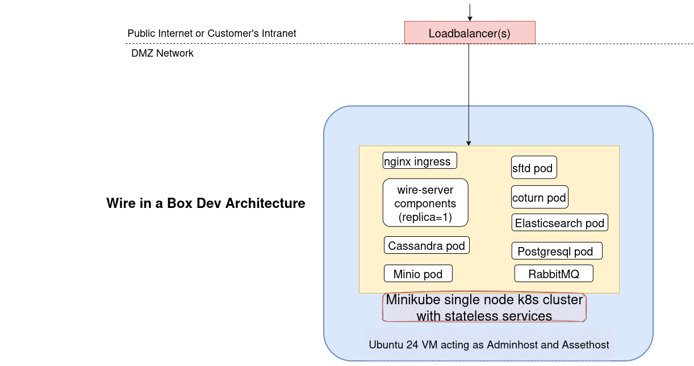
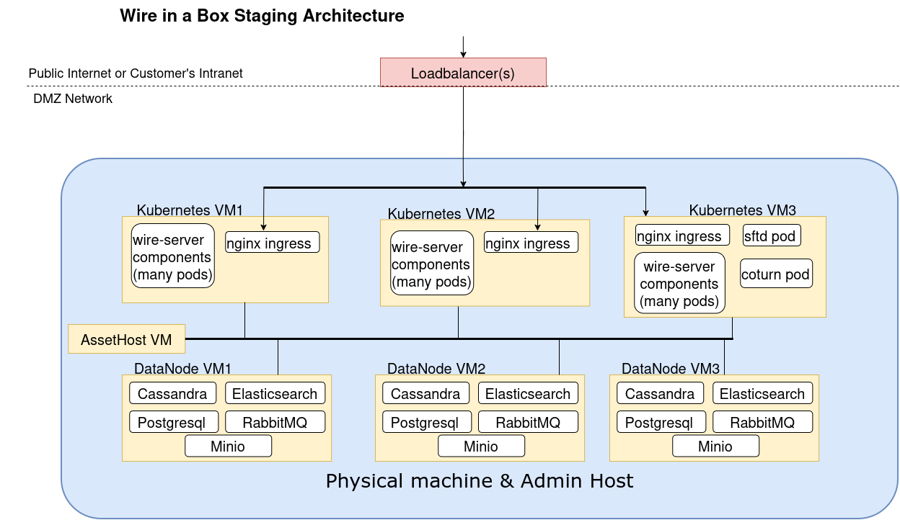

# Implementation plan

There are three types of installation targets for Wire: **WIAB Dev (formerly WIAB Demo)**, **WIAB Staging**, and **Production**. This page helps you choose the right one and points you to the corresponding guides.

## Deployment options at a glance

| Option          | Purpose                                  | Scale & Topology                          | Persistence           | Typical Audience                     |
|-----------------|-------------------------------------------|-------------------------------------------|------------------------|--------------------------------------|
| WIAB Dev        | Quick functional demo on a single VM     | 1 Ubuntu 24.04 VM with Minikube           | No (ephemeral data)    | Developers, PoC, quick evaluations   |
| WIAB Staging    | Realistic multi-VM, non-production setup | ~7 Ubuntu 22.04 VMs on 1 physical host    | Yes (multi-service)    | Infra/ops testing, training     |
| Production      | High-availability, long-term deployment  | Separate DB VMs + 2 Kubernetes cluster      | Yes (HA, backups, etc.)| Production operations                |

- **WIAB Dev** is a self-contained, single-node demo environment (previously called *WIAB Demo*). All core services run on one VM, using in-cluster, ephemeral datastores. It is ideal for trying out functionality but **not suitable for production**.
- **WIAB Staging** reproduces the production architecture using a fixed set of virtual machines hosted on a single physical box. It is persistent but still a single failure domain and therefore **not production-grade**.
- **Production** uses dedicated virtual machines for databases and a Kubernetes cluster for Wire services. It is designed for **durability, scale, and high availability**.

> **Important:** There is no supported migration path from WIAB Dev or WIAB Staging to Production. Treat them as disposable environments.

## WIAB Dev (single-VM Wire-in-a-Box)

**Use this if:**

- You want to see Wire running quickly.
- You are evaluating features or doing development integration.
- You are happy to lose the data when you tear down the VM or during restart.

**Key characteristics:**

- Single Ubuntu 24.04 VM (No hypervisor support required)
- Minikube-based Kubernetes cluster runs on the same node.
- Ephemeral datastores (no external DBs or storage appliances required).
- Includes webapp, account pages, team settings page, demo SMTP, coturn, and a cert-manager with Let’s Encrypt (unless you choose bring-your-own certificates).
- Intended for roughly **15-50 users** in small test teams; this is guidance only, not a performance benchmark.

For full demo architecture, requirements, deployment steps, and cleanup instructions, see:

- **Guide:** [`WIAB Dev (Demo Wire-in-a-Box) Deployment`](demo-wiab.md#wiab-dev-demo-wire-in-a-box-deployment-guide)

> **Internet requirement for WIAB Dev:** The WIAB Dev playbook assumes that the deploy_node has outbound internet connectivity during installation. Tooling such as Minikube, Docker, kubectl, Python packages, and system packages are downloaded from public repositories and are **not shipped inside the artifact bundle**. After installation, you can lock down outbound access more aggressively, but Let’s Encrypt certificate renewal (if used) will still require periodic internet access.

## WIAB Staging (multi-VM KVM-based test cluster)

**Use this if:**

- You want to rehearse a production-style deployment or upgrade process.
- You want realistic separation of roles (kubernetes vs data services vs assets) on multiple VMs.
- You want a staging Wire server with stateful services.

**Key characteristics:**

- One physical machine with hardware virtualization support (KVM).
- Typically **7 VMs** (Ubuntu 22.04) to simulate a production layout:
  - `assethost`  – asset and artifact host.
  - `kubenode1–3`  – Kubernetes control-plane and worker nodes running Wire services and calling.
  - `datanode1–3`  – data services such as Cassandra, RabbitMQ, Postgresql, Minio and Elasticsearch.
- Wire is deployed using an offline artifact bundle (`wire-server-deploy`), Ansible, and Helm.
- Suitable for up to **100 users** with teams smaller than **100 users per team**; capacity here is for staging realism, not for production sizing.

> **Internet requirement for WIAB Staging provisioning:** If you use the WIAB Staging provisioning Ansible playbook to create the VMs on your physical host, that provisioning step will require internet access to download the supporting tools and images it needs (for example VM cloud images and KVM/libvirt tooling). Once the VMs and the Wire artifact are in place, subsequent deployment stages can run with limited or no internet, depending on your TLS/certificate setup.

For detailed requirements, VM sizing, playbook usage, and follow-up cluster deployment steps, see:

- **Guide:** [`WIAB Staging Deployment`](wiab-staging.md)

## Production installation (persistent data, high-availability)

What you need:

- a way to create **DNS records** for your domain name (e.g. `wire.example.com`)
- a way to create **SSL/TLS certificates** for your domain name (to allow connecting via `https://wire.example.com`)
- two **kubernetes clusters with at least 3 worker nodes each** (some cloud providers offer a managed kubernetes cluster these days)
  - First (primary) kubernetes cluster will be used by wire-server and supporting services. Second kubernetes cluster aka secondary would be used for calling workload. Calling infrastructure is designed to operate in a Zero trust / DMZ environment, so that the networking requirements of calling can be separated from the sensitive data stored in your Wire backend (primary) k8s cluster. Read more about Wire architecture [here](../../understand/overview.md#backend-routing)
- minimum **23 virtual machines** for components outside kubernetes (cassandra, minio, elasticsearch, rabbitmq, postgresql)

A recommended installation of Wire-server in any regular data centre, configured with high-availability will require the following virtual servers:

| Name                                                 | VM Count | CPU Cores per VM | Memory (GB) per VM | Disk Space (GB) per VM|
|------------------------------------------------------|----------|--------------|---------------|-------------------|
| Cassandra                                            | 3        | 1            | 2             | 80                |
| Postgresql                                           | 3        | 1            | 2             | 80                |
| MinIO                                                | 3        | 1            | 2             | 400               |
| ElasticSearch                                        | 3        | 1            | 2             | 60                |
| RabbitMQ                                             | 3        | 2            | 4             | 80                |
| Primary Kubernetes (k8s control/worker node)         | 3        | 6            | 8             | 80                |
| Admin Host                                           | 1        | 1            | 4             | 90                |
| Asset Host                                           | 1        | 1            | 4             | 100               |
| Stateful Services Totals per physical node           | -        | 14 CPU Cores | 32 GB Memory  | 970 GB Disk Space |
| Secondary Kubernetes (Calling Services)           | 3        | 4            | 10            | 70                |
| Single Server Totals                                 |  -       | 18 CPU Cores | 44 GB Memory  | 1060 GB Disk Space |

> Notes:
> - Secondary kubernetes hosts may need more resources to support heavy conference calling. For concurrent SFT users (SFT = «Selective Forwarding Turn» server, ie. Conference calling), we recommend an extra 3% of CPU allocation, evenly distributed across the nodes (i.e. 1% more CPU per kubernetes server). So for every 100 users plan on adding one CPU core on each Kubernetes node. The SFT component runs inside of Kubernetes, and does not require a separate virtual machine for operation.  
> - Admin Host and Asset Host can run on any one of the 3 servers, but the respective server must allocate additional resources as indicated in the table above.  
> - Wire requires the usage of CPUs built on the AMD64 architecture, and assumes these are running at the equivalent CPU/Memory performance of a recent Intel/AMD server system clocked at at least 2.5Ghz. For reference, please refer to https://cpubenchmark.net/high_end_cpus.html  
> - Systems which are running under virtualization must be using Hardware Virtualization Support.  
> - Each Virtual core should correspond to a reservation of one physical core, not a thread.  
> - Note that some performance will be lost with mitigations for Spectre, Meltdown, and other security patching, so plan reserve capacity as appropriate.  
> - Disk space requirements are referring to formatted, local disk space. The use of network file storage solutions may be incompatible with Wire deployment and operation. Let us know if you are considering this type of solution.  
> - Disk space must be SSD or NVMe. We recommend against using spinning disks. 

General Hardware Requirements: 
- Minimum 3 physical servers required in 3 availability zones.
- Wire has a minimum requirement for a total of 23 Ubuntu 22.04 virtual machines across the 3 servers (in accordance with the table above)

### Capacity and scalability

This architecture is specified to support **4,000 or fewer messaging (chat, IM) users**, divided into teams of **less than 1,500 users per team**. For larger deployments, a modified architecture and additional capacity planning may be advised.

This infrastructure is **scalable**. The 4,000-user figure is an initial sizing point, not a hard upper bound. You can scale out further (more nodes, more resources) based on your requirements. For a full infrastructure guide and scaling plan tailored to your use case, contact **Wire deployment support** via <https://support.wire.com/>.

A production installation will look a bit like this:

If you use a private datacenter (not a cloud provider), the easiest is to have three physical servers, each with one virtual machine for each server component (cassandra, minio, elasticsearch, rabbitmq, postgresql).

It’s up to you how you create these VMs - kvm on a bare metal machine, VM on a cloud provider, etc. Make sure they run ubuntu 22.04.

### Artifact bundle and offline deployment

An **artifact** is a collection of binaries, Ansible playbooks, Bash scripts, Helm charts, and container images that has been verified to work together and is compatible for deploying a specific version of Wire Server. Having an artifact also allows deployments in **private or offline environments** without needing direct access to the public internet.

A typical production or WIAB Staging artifact bundle contains (folder names may vary slightly by release):

- `ansible/`  – playbooks, roles, templates, and example inventories.
- `bin/`  – helper scripts for Ansible runs, VM provisioning, secret generation, and Helm operations.
- `binaries.tar`  – datastore binaries and tooling to support the Kubernetes cluster.
- `charts/`  – Helm charts for Wire and supporting components.
- `containers-adminhost/`  – helper container images with Ansible/Helm/kubectl tooling.
- `containers-helm.tar`  – container images for Wire and supporting Helm charts.
- `containers-system.tar`  – container images for Kubernetes and base system components.
- `dashboards/`  – Grafana dashboard definitions.
- `debs-jammy.tar`  – deb packages for Ubuntu 22.04 (jammy) to support installation without public APT.
- `values/`  – templated Helm values for on-prem deployments for a specific wire-server installation
- `versions/`  – version metadata for images and binaries.

The default Ansible inventories on the **master** branch of `wire-server-deploy` reference **pre-configured artifacts** for **WIAB Dev** and **WIAB Staging**. These bundles differ per solution type and are tied to a specific Wire backend version and its dependencies.

If the default bundle for WIAB Dev or WIAB Staging does not meet your needs (for example, you require a different Wire version), please reach out to **Wire support**. They can provide a download link for a compatible artifact bundle to assist with your deployment.

Relationship to each solution:

- **WIAB Dev (Demo)**  – uses the bundle primarily for Helm charts and container images, but still requires internet access for system and tooling packages during installation (see the WIAB Dev guide).
- **WIAB Staging**  – relies heavily on the artifact for offline deployment of Kubernetes components, data services, and Wire itself after the initial VM provisioning.
- **Production**  – can use artifact bundles to perform fully offline or tightly controlled deployments where direct internet access from the cluster nodes is not allowed.

When planning an offline or staging-style deployment, also consider:

- How and where secrets are generated and stored (see [Secrets Overview](secrets-overview.md)).
- Which environments will be allowed to reach external services (Let’s Encrypt, package mirrors, monitoring, etc.).

### Next steps for high-available production installation

Your next step will be [Installing kubernetes and databases on VMs with ansible](ansible-VMs.md#ansible-vms) and [Installing wire-server (production) components using Helm](helm-prod.md).

In a typical production network layout:

- Core messaging components and databases run in a protected cluster.
- Calling services (coturn/SFTD) are deployed on nodes or a cluster placed in a **DMZ** or dedicated edge network, with:
  - Public reachability on UDP 3478 and the configured media port range.
  - Controlled, internal connectivity back to the messaging cluster for signalling.

See [Network Ports and Connectivity](network-ports.md#production-network-architecture-messaging-vs-calling) for more details on how messaging and calling traffic are separated in production.
