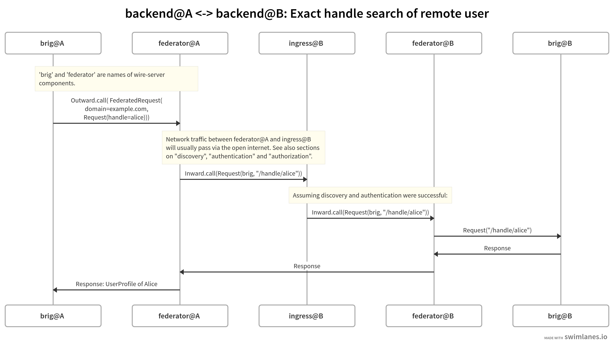

Architecture and Network
=========================

TODO.

Flow of information between server components
------------------------------------------------

Assuming two installations hosted on subdomains of ``a.example.com`` (A) and ``b.example.com`` (B).

Example of the network connections made between the components of two :ref:`backends <backend>` for a user search (*'exact handle search'*):

|flow-exact-handle-search|

Other requests for federation will be similar to the above:

* Depending on the request made by user 1 registered on backend A, different wire-server components (e.g. 'brig', 'galley', or 'gundeck') will make a request over their local network to the 'federator' component.
* The 'federator' will, for requests to other backends:

  #. If enabled, ensure the target domain is in the :ref:`allow list <allow-list>`
  #. :ref:`discover <discovery>` the other backend
  #. make an :ref:`authenticated call <authentication>` to the other backend
  #. forward the response back to the originating component (and eventually to the originating Wire client)

.. _discovery:

Discovery
----------

TODO.

.. _authentication:

Authentication
---------------

TODO.

.. _authorization:

Authorization
---------------

.. _allow-list:

Domain Allow List
^^^^^^^^^^^^^^^^^^

Federation can happen between any backends on a network (e.g. the open internet); or it can be restricted :ref:`via server configuration <how-to-configure-federation>` to happen between a specified set of domains on an 'allow list'. If an allow list is configured, then:

* outgoing requests will only happen if the requested domain is contained in the allow list.
* incoming requests:

  * TODO.

Per-request Authorization
^^^^^^^^^^^^^^^^^^^^^^^^^^

TODO.

..
  paths to images are currently listed at the end of the file. If you prefer to specify them directly in the paragraph they are used, that is also fine.

