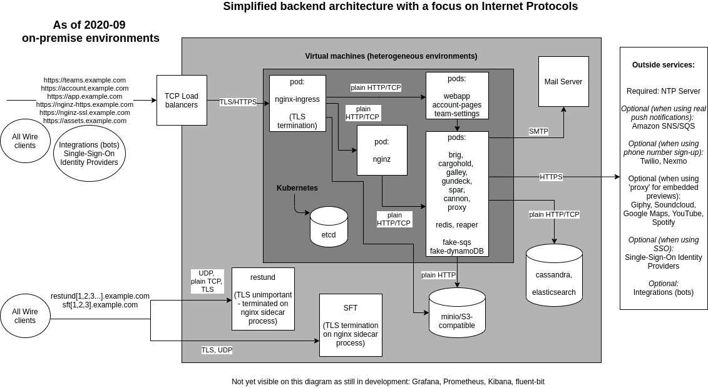

<a id="overview"></a>

# Architecture Overview

## Introduction

In a simplified way, the server components for Wire involve the following:


The Wire clients (such as the Wire app on your phone) connect either directly or through a load balancer to the “Wire Server”.  The term “Wire Server” refers to a set of API server components that work together and also communicate with various databases. Both the API components and the databases are each deployed in a “cluster”, a setup where multiple instances of the same service run in parallel. This design ensures that if one instance fails, others continue to serve requests without disruption. This fault-tolerant setup is known as high availability, and it helps ensure a seamless experience for users even during component failures.

## Architecture and networking

### Client communications
Users use Wire Clients, either installed with the Wire application locally, or by using the web version of the Wire application. Let's take a look at the Wire backend, from the perspective of a client device:


The above graph gives us a rough breakdown of which domains are used for which parts of the platform.

#### Wire Web Applications
The Wire web application is started by a web browser opening up https://webapp.example.com/ . Similarly, Teams in Wire are managed by loading the Team Management application, reachable at https://teams.example.com/ . Both of these web applications are static, which is to say, the application that is loaded uses the Wire API to perform all actions, and has no "state" in the backend. the 'account' application is not meant for users to directly access, and contains pages to manage password resets, and other special pages not a part of team settings or the Wire Webapp.

#### Wire API Access
All actions in the Wire applications require Wire API access, which is generally granted when a user logs into a Wire client device (including Webapp). There are no "long lived" connections in the API, when a client is using the application, they perform their API call, then the connection ends. 

#### Wire WebSocket Notifications
As Wire is an interactive application, from time to time, we need to tell the client something has happened. This involves holding open a "long-lived" connection to the backend, via the WebSocket API over HTTP. 

#### Asset Retrieval
Files, Voice Messages, Pictures, and other items users upload to the Wire backend for distribution are referred to as 'assets' in Wire. Asset requests are handled on the "https://assets.example.com/" domain, which is separate from the rest of Wire, so that customers have the option of using caching (Cloudflare, etc) services to speed up their downloads. All assets other than profile pictures are encrypted-at-rest in the assets database (usually, S3 or an S3-like service).

#### Calling
In general, both of Wire's calling services have two phases of communicating with them: there's the signaling phase, which creates, reserves, and communicates about the call, then there is the active phase, where audio/video data is being transferred in-between the participants. The last part of the signaling phase of all calls is performed by sending messages over the Wire Messaging Platform, in order to inform participants about the existence and location of a call.

##### Conference Calling
Conference calling in Wire is managed by a dedicated service, named "SFT". This service uses HTTPS to perform the signaling parts of setting up a call, but uses a proprietary derivative of the TURN protocol over UDP to actually transfer calling content. This is why it goes both to a load balancer (for HTTPS), and to a firewall (to forward on UDP packets).

##### Personal Calling
Individual calling between pairs of participants in the Wire application is managed by a version of https://github.com/coturn/coturn , which Wire has extended for denial of service hardening. This service does not use HTTPS at any point, but does speak the TURN protocol, only deviating from the published standard in the area of authentication.

#### Mobile Notifications
At this point, you might be wondering "what's that Amazon thing up in the corner?". For mobile clients (AKA, cellphones), Wire utilizes Google and Apple push notification services to send a message to the client devices when they need to go check the backend for messages. This is because keeping a "long lived" connection to the backend causes a major battery draw on android, and is simply not possible on apple devices. If complete secrecy is required, the android client is permitted to go into a "websocket-only" mode, where it will use the websocket instead of the cell phone network. This, of course, drains the battery, as the messages required to keep the "long-lived" connection going require regular contact to your backend, and require "waking up" the mobile device regularly, preventing it from going into deeper power savings modes.

### Wire Messaging Cluster

The Wire Messaging Cluster is where all of the non-calling components of Wire are deployed. 

Wire clients (such as the Wire app on your phone) connect to your Wire cluster through a load balancer in order to exchange messages, retrieve assets, notify each other about calls, and perform other interactions with other Wire users. The load balancer forwards traffic to the ingress inside the kubernetes VMs. Wire needs a load balancer for this, so that in the case of a failure of the hardware Wire is running on, the load balancer can switch where it sends traffic to, ensuring a continuous service.

The nginx ingress pods inside kubernetes look at incoming traffic, and forward that traffic on to the right place, depending on what’s inside the URL passed. For example, if a request comes in for `https://nginz-https.example.com`, it is forwarded to a component called `nginz`, which is the main entry point for the [Wire-server API](https://github.com/Wireapp/Wire-server). If, however, a request comes in for `https://webapp.example.com`, it is forwarded to a component called [Webapp](https://github.com/Wireapp/Wire-webapp), which hosts the graphical browser Wire client (as found when you open [https://app.Wire.com](https://app.Wire.com)).


### Backend Routing

Now that we have a good grasp of how traffic gets from client devices to your Wire Messaging Cluster and your Wire Calling Cluster, let's examine how traffic is routed inside of the Wire clusters.


### Wire Messaging Cluster
The Wire Messaging Kubernetes Cluster is where your Wire environment lives. Traffic headed into your Wire Messaging Cluster breaks down into four categories: access to static sites (EG: Webapp, account, or teams), asset retrieval (when using MinIO), web sockets, or communications with the Backend API.

#### Static Sites
Account pages, Team Management, and the Webapp are static applications, which is to say, if you try to download them, the content is the same each time. While what you see in the application changes, that's because what you are seeing is content presented from the Backend API, not because what you retrieve from the application's hosting service is any different.

For static sites, their traffic enters the kubernetes cluster through your load balancer. There, it is sent to the nginx ingress, and then directly to the pods serving the static application.

#### Asset Retrieval
For customers who do not have a Wire compatible S3 API, Wire will configure a MinIO S3-like service. This service is where items such as profile pictures, file contents, and uploaded images rest. Everything in this service is encrypted-at-rest, with the exception of the profile pictures.

If you have MinIO hosting your assets, then requests for assets will travel through your load balancer. There, it is sent to the nginx ingress, which directs said request to the MinIO cluster.

#### Web Sockets
In order for Wire to communicate that something has happened (a message sent, a read receipt, someone started typing...), a WebSocket may be kept open, between clients and the backend. This is a channel a client and the backend communicates over bidirectionally. A 'ping-pong' is sent every 30 seconds across the link, to keep it active, and so that if it is closed or interrupted, it can be re-opened.

Web Sockets are a part of the Wire Backend API. As such, the direction of their traffic is through the Wire Messaging Load Balancer, through the first Nginx ingress, but also through a second modified Nginx ingress, we call NginZ. This ingress checks to make sure a user is authenticated, before passing it deeper into the messaging services, for the web socket to be serviced.

#### Backend API Communications
In order for users to read or change anything in Wire, they need to use the Backend API. This is the API provided by Wire's Messaging Services, which most user activity is performed over.

Traffic destined to the backend API is sent through the Wire Messaging Load Balancer, through the first Nginx ingress, through the NginZ Ingress (assuming it is authorized!), then onward to the service designated for that endpoint. NginZ contains the knowledge of which service a given endpoint needs to go to, as well as the type of authentication required to reach that endpoint.

### Wire Calling Cluster
Wire's calling services are divided into two: 1<->1 calling is performed through a modified version of coturn, while conference calling goes through a Wire-developed service, called SFT. Both of these services follow a similar model: They have a signaling phase, where call participants can create, join, and end calls, and a "in-call" phase, where call traffic is actually transferred. During the "in-call" phase, both services open a UDP port which all call participants communicate with, which is where the call "happens". All callers participating in a call will be contacting the calling service on the same UDP port.

Communications from your end users to your Wire Calling Cluster need to go both through a load balancer, AND through one or more firewalls. The load balancer handles HTTPS traffic to `https://sft1.example.com/` and other SFT domains, while the firewalls handle the UDP traffic.

#### Coturn
For one-to-one calls (calls initiated in a 1:1 conversation), Coturn is used. Our release of Coturn is extended for DDOS prevention, federated calling support, and has a modified authentication API.

When a Wire user in a 1:1 conversation tries to place a call, the participating clients first try to find a route directly between them. If a route can be found, call data is routed between the clients directly, completely bypassing the backend.

Only when the above fails, does the user's Wire client rely on the backend for call content relaying. This means calls can be succeeding even when the backend is completely unreachable.

##### Signaling
During the signaling phase, Wire clients will attempt to discover each other directly. This works well for people residing on the same network; they do not even need to be able to reach the calling server to have a call! While they are trying to discover each other, the client initiating the call will also attempt to reserve a call relay on each of your Coturn servers. 

If the Wire clients can directly talk to one another, they will cancel their reservations. If they receive a reservation, they will cancel any other reservation requests in-flight, reserving only one call relay point. This gives us direct connections when possible, and when it's not possible, the call relay will stand up on the quickest-to-respond coturn server.

Wire clients attempting to place a call will connect to port 3478 of `coturn0.example.com` and other Coturn domains, to reserve a call relay. This traffic will arrive at a firewall in your environment, where it will be sent directly to a specific node in the calling kubernetes cluster, where the coturn process will handle the traffic directly.

##### Calling
Once a call relay has been reserved, all participants will be notified of it over Wire messages, by telling the participants the IP and port to connect to. They will all connect through the appropriate calling firewall (identified by IP), and traffic will be sent directly to a specific kubernetes node.

#### SFT
SFT is Wire's Selectively Forwarding TURN Service. Wire uses SFT to host conference calls in all Wire Groups and Channels.

##### Signaling
Signaling works completely differently than it does in coturn calls. Signaling is handled via HTTP, rather than UDP ports. This makes debugging easier, but does require the use of a load balancer in front of your Wire Calling Cluster, to handle HTTPS encrypted signaling.

Wire clients attempting to create a conference call will use HTTPS to contact `https://sft1.example.com` and other SFT domains. This traffic arrives at the Wire Calling Cluster's load balancer, and is directed into the cluster through a standard nginx instance. This instance relays traffic to one of the 'join-call' ingresses, which in turn relays to the requested SFT server. As with Coturn, clients will attempt to reserve on all of the nodes, and keep the reservation that 'arrives first'.

##### Calling
Once a conference call has been created, all participants will be notified of it over Wire messages, by telling the participants the DNS name and port to connect to. They will all connect through the appropriate calling firewall (identified by DNS), and traffic will be sent directly to a specific kubernetes node.


### Backend Services

While they are running, the Wire services in your Wire Messaging Cluster require a variety of databases and endpoints to communicate with. Let's familiarize you with the backend services, and what they need to communicate to to do their jobs.


In the above graph, we show you the 7 major backend services, and what they communicate with.

#### Gundeck
[Gundeck](https://github.com/wireapp/wire-server/blob/develop/services/gundeck) is the Push Notification Hub. It is the clearing house for notifications in the wire backend, handling both WebSocket and Mobile push notifications. It delivers APNS/FCM push notifications via our in-Amazon proxy service(SNS and SQS based), and delivers WebSocket notifications by finding the right cannon, and sending the notification to the cannon attached to the user's client. It is gaining some notification-through-rabbitMQ functionality in a future release.

Gundeck requires DNS, and working connectivity to Amazon in order to deliver push notifications to iOS and Android phones.

Gundeck uses Redis to keep track of which cannon owns which client. Wire ships a high-availability ephemeral Redis service along with your backend distribution, which is used in your Wire Messaging Kubernetes cluster.

#### Background-Worker
[Background-worker](https://github.com/wireapp/wire-server/blob/develop/services/background-worker/) is a background service, used for handling the "we should really delete all of this in the database, that takes work, handle it later" cases. This way other services can mark data for deletion, but let the background worker delete them. 

Backend-worker only requires access to Cassandra, and RabbitMQ.

#### Cannon
[Cannon](https://github.com/wireapp/wire-server/blob/develop/services/cannon/) is the service which holds WebSockets. It distributes notifications given to it by `gundeck`, sending them over the WebSocket connected to a user's client. 

All incoming WebSocket requests (anything that goes to `nginx-ssl.example.com`) are sent to Cannon.

Cannon only needs access to RabbitMQ and Cassandra. 
#### Galley
[Galley](https://github.com/wireapp/wire-server/blob/develop/services/galley/) is the [Conversations and Teams API](../understand/api-client-perspective/README.md). It handles conversation and 1:1 message delivery. It gives `gundeck` notifications to send to users' devices.

Galley requires access to RabbitMQ, Cassandra, and Postgres.

#### Spar
[Spar](https://github.com/wireapp/wire-server/blob/develop/services/spar/) is the component of Wire responsible for [Single Sign On (SSO)](https://en.wikipedia.org/wiki/Single_sign-on) and [SCIM](https://en.wikipedia.org/wiki/System_for_Cross-domain_Identity_Management).

Despite the interconnected role of integrating Wire with your Authentication and Authorization systems, Spar only requires access to the Cassandra database.

#### Brig

[brig](https://github.com/wireapp/wire-server/tree/develop/services/brig) is the user management API of Wire. It's responsible for username/password login and logout, sending emails, and user search. 

Brig is the only user of `elasticsearch`, which is used for an ephemeral cache of user information, to speed up search functions.

Brig uses Elasticsearch Cassandra, Postgres and RabbitMQ. Additionally, it will from time to time connect to a mail service, to deliver email.
#### Cargohold
[Cargohold](https://github.com/wireapp/wire-server/tree/develop/services/cargohold) is the Asset Storage API of Wire. It uses Amazon-AWS-S3-style services to store encrypted files that users are sharing amongst each other, such as images, file attachments, voice messages, and other static content, which we call assets. All assets except profile pictures are symmetrically encrypted before storage (and the keys are only known to the participants of the conversation in which an asset was shared - servers have no knowledge of the keys).

Cargohold only needs to speak to your S3 hosting service.
### Focus on internet protocols



### Focus on high-availability

The following diagram shows a usual setup with multiple VMs (Virtual Machines):


All the server components on one physical machine can connect to all the databases (also those on a different physical machine). The databases each connect to each-other, e.g. cassandra on machine 1 will connect to the cassandra VMs on machines 2 and 3.

### Backend components startup

The Wire server backend is designed to run on a kubernetes cluster. From a high level perspective the startup sequence from machine power-on to the Wire server being ready to receive requests is as follows:

1. *Kubernetes node power on*. Systemd starts the kubelet service which makes the worker node available to kubernetes. For more details about kubernetes startup refer to [the official kubernetes documentation](https://kubernetes.io/docs/reference/setup-tools/kubeadm/implementation-details/). For details about the installation and configuration of kubernetes and worker nodes for Wire server see [Installing kubernetes and databases on VMs with ansible](../how-to/install/ansible-VMs.md#ansible-vms)
2. *Kubernetes workload startup*. Kubernetes will ensure that Wire server workloads installed via helm are scheduled on available worker nodes. For more details about workload scheduling refer to [the official kubernetes documentation](https://kubernetes.io/docs/concepts/scheduling-eviction/kube-scheduler/). For details about how to install Wire server with helm refer to [Installing wire-server (production) components using Helm](../how-to/install/helm-prod.md#helm-prod).
3. *Stateful workload startup*. Systemd starts the stateful services (cassandra, elasticsearch and minio). See for instance [ansible-cassandra role](https://github.com/wireapp/ansible-cassandra/blob/master/tasks/systemd.yml#L10) and other database installation instructions in [Installing kubernetes and databases on VMs with ansible](../how-to/install/ansible-VMs.md#ansible-vms)
4. *Other services*. Systemd starts the restund docker container. See [ansible-restund role](https://github.com/wireapp/ansible-restund/blob/9807313a7c72ffa40e74f69d239404fd87db65ab/templates/restund.service.j2#L12-L19). For details about docker container startup [consult the official documentation](https://docs.docker.com/get-started/overview/#docker-architecture)

#### NOTE
For more information about Virtual Machine startup or operating system level service startup, please consult your virtualisation and operating system documentation.

### Focus on pods

The Wire backend runs in [a kubernetes cluster](https://kubernetes.io/), with different components running in different [pods](https://kubernetes.io/docs/concepts/workloads/pods/).

This is a list of those pods as found in a typical installation.

HTTPS Entry points:

- `nginx-ingress-controller-controller`: [Ingress](https://kubernetes.github.io/ingress-nginx/) exposes HTTP and HTTPS routes from outside the cluster to services within the cluster.
- `nginx-ingress-controller-default-backend`: [The default backend](https://kubernetes.github.io/ingress-nginx/user-guide/default-backend/) is a service which handles all URL paths and hosts the nginx controller doesn’t understand (i.e., all the requests that are not mapped with an Ingress), that is, 404 pages. Part of `nginx-ingress`.

Frontend pods:

- `Webapp`: The fully functioning Web client (like [https://app.wire.com](https://app.wire.com)). [This pod](https://github.com/wireapp/wire-docs/blob/master/src/how-to/install/helm.rst#what-will-be-installed) serves the web interface itself, which then interfaces with other services/pods, such as the APIs.
- `account-pages`: [This pod](https://github.com/wireapp/wire-docs/blob/master/src/how-to/install/helm.rst#what-will-be-installed) serves Web pages for user account management (a few pages relating to e.g. password reset).
- `team-settings`: Team management Web interface (like [https://teams.wire.com](https://teams.wire.com)).

Pods with an HTTP API:

- `nginz`: Public API Reverse Proxy (Nginx with custom libzauth module). A modified copy of nginx, compiled with a specific set of upstream extra modules, and one important additional module zauth_nginx_module. Responsible for user authentication validation. Forwards traffic to all other API services (except federator)
- `federator`: [Connects different wire installations together](./federation/README.md). Wire Federation, once implemented, aims to allow multiple Wire-server backends to federate with each other. That means that a user 1 registered on backend A and a user 2 registered on backend B should be able to interact with each other as if they belonged to the same backend.

Supporting pods and data storage:

- `cassandra-ephemeral` (or `cassandra-external`): [NoSQL Database management system](https://github.com/wireapp/wire-server/tree/develop/charts/cassandra-ephemeral) ([https://en.wikipedia.org/wiki/Apache_Cassandra](https://en.wikipedia.org/wiki/Apache_Cassandra)). Everything stateful in wire-server (cassandra is used by `brig`, `galley`, `gundeck` and `spar`) is stored in cassandra.
  \* `cassandra-ephemeral` is for test clusters where persisting the data (i.e. loose users, conversations,…) does not matter, but this shouldn’t be used in production environments.
  \* `cassandra-external` is used to point to an external cassandra cluster which is installed outside of Kubernetes.
- `demo-smtp`: In “demo” installations, used to replace a proper external SMTP server for the sending of emails (for example verification codes). In production environments, an actual SMTP server is used directly instead of this pod. ([https://github.com/namshi/docker-smtp](https://github.com/namshi/docker-smtp))
- `fluent-bit`: A log processor and forwarder, allowing collection of data such as metrics and logs from different sources. Not typically deployed. ([https://fluentbit.io/](https://fluentbit.io/))
- `elastisearch-ephemeral` (or `elastisearch-external`): [Distributed search and analytics engines, stores some user information (name, handle, userid, teamid)](https://github.com/wireapp/wire-server/tree/develop/charts/elastisearch-external). Information is duplicated here from cassandra to allow searching for users. Information here can be re-populated from data in cassandra (albeit with some downtime for search functionality) ([https://www.elastic.co/what-is/elasticsearch](https://www.elastic.co/what-is/elasticsearch)).
  \* `elastisearch-ephemeral` is for test clusters where persisting the data doesn’t matter.
  \* `elastisearch-external` refers to elasticsearch IPs located outside kubernetes by specifying IPs manually.
- `fake-aws-s3`: Amazon-AWS-S3-compatible object storage using MinIO ([https://min.io/](https://min.io/)), used by cargohold to store (encrypted) assets such as files, posted images, profile pics, etc.
- `fake-aws-s3-reaper`: Creates the default S3 bucket inside fake-aws-s3.
- `fake-aws-sns`. [Amazon Simple Notification Service (Amazon SNS)](https://docs.aws.amazon.com/AmazonS3/latest/userguide/NotificationHowTo.html), used to push messages to mobile devices or distributed services. SNS can publish a message once, and deliver it one or more times.
- `fake-aws-sqs`: [Amazon Simple Queue Service (Amazon SQS) queue](https://docs.aws.amazon.com/AmazonS3/latest/userguide/NotificationHowTo.html), used to transmit any volume of data without requiring other services to be always available.
- `redis-ephemeral`: Stores WebSocket connection assignments (part of the `gundeck` / `cannon` architecture).

Short running jobs that run during installation/upgrade (these should usually be in the status ‘Completed’ except immediately after installation/upgrade):

- `cassandra-migrations`: Used to initialize or upgrade the database schema in cassandra (for example when the software is upgraded to a new version).
- `galley-migrate-data`: Used to upgrade data in `cassandra` when the data model changes (for example when the software is upgraded to a new version).
- `brig-index-migrate-data`: Used to upgrade data in `cassandra` when the data model changes in brig (for example when the software is upgraded to a new version)
- `elastisearch-index-create`: [Creates](https://github.com/wireapp/wire-server/blob/develop/charts/elasticsearch-index/templates/create-index.yaml#L29) an Elastisearch index for brig.
- `spar-migrate-data`: [Used to update spar data](https://github.com/wireapp/wire-server/blob/develop/charts/cassandra-migrations/templates/spar-migrate-data.yaml) in cassandra when schema changes occur.

As an example, this is the result of running the `kubectl get pods --namespace wire` command to obtain a list of all pods in a typical cluster:

```shell
NAMESPACE      NAME                                                      READY   STATUS      RESTARTS   AGE
wire           account-pages-54bfcb997f-hwxlf                            1/1     Running     0          85d
wire           brig-58bc7f844d-rp2mx                                     1/1     Running     0          3h54m
wire           brig-index-migrate-data-s7lmf                             0/1     Completed   0          3h33m
wire           cannon-0                                                  1/1     Running     0          3h53m
wire           cargohold-779bff9fc6-7d9hm                                1/1     Running     0          3h54m
wire           cassandra-ephemeral-0                                     1/1     Running     0          176d
wire           cassandra-migrations-66n8d                                0/1     Completed   0          3h34m
wire           demo-smtp-784ddf6989-7zvsk                                1/1     Running     0          176d
wire           elasticsearch-ephemeral-86f4b8ff6f-fkjlk                  1/1     Running     0          176d
wire           elasticsearch-index-create-l5zbr                          0/1     Completed   0          3h34m
wire           fake-aws-s3-77d9447b8f-9n4fj                              1/1     Running     0          176d
wire           fake-aws-s3-reaper-78d9f58dd4-kf582                       1/1     Running     0          176d
wire           fake-aws-sns-6c7c4b7479-nzfj2                             2/2     Running     0          176d
wire           fake-aws-sqs-59fbfbcbd4-ptcz6                             2/2     Running     0          176d
wire           federator-6d7b66f4d5-xgkst                                1/1     Running     0          3h54m
wire           galley-5b47f7ff96-m9zrs                                   1/1     Running     0          3h54m
wire           galley-migrate-data-97gn8                                 0/1     Completed   0          3h33m
wire           gundeck-76c4599845-4f4pd                                  1/1     Running     0          3h54m
wire           nginx-ingress-controller-controller-2nbkq                 1/1     Running     0          9d
wire           nginx-ingress-controller-controller-8ggw2                 1/1     Running     0          9d
wire           nginx-ingress-controller-default-backend-dd5c45cf-jlmbl   1/1     Running     0          176d
wire           nginz-77d7586bd9-vwlrh                                    2/2     Running     0          3h54m
wire           redis-ephemeral-master-0                                  1/1     Running     0          176d
wire           spar-8576b6845c-npb92                                     1/1     Running     0          3h54m
wire           spar-migrate-data-lz5ls                                   0/1     Completed   0          3h33m
wire           team-settings-86747b988b-5rt45                            1/1     Running     0          50d
wire           webapp-54458f756c-r7l6x                                   1/1     Running     0          3h54m
                  1/1     Running     0          3h54m
```

#### NOTE
This list is not exhaustive, and your installation may have additional pods running depending on your configuration.
