# How to set up SSO integration with Microsoft Entra ID

## Purpose and Scope
This document is for users who want to manage their users with Microsoft Entra ID, in Azure.

## Prerequisites
Before you begin, we are going to assume you have the following:

* An account on <http://azure.microsoft.com>
* Admin access to that account, sufficient to add an application, and manage users.
* A team on https://app.wire.com/ or another wire backend, and administrative access to that team.

## Process

### Creating a New Application

Go to <https://portal.azure.com/> and login. You should be brought to the 'Microsoft Azure' home page.

In the 'Azure services' section, click on 'Microsoft Entra ID':

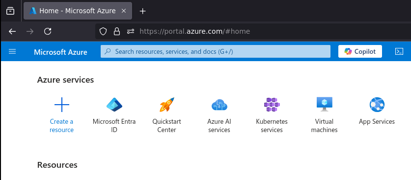

You should now see the 'Default Directory | Overview' page.

In the menu to your left, 'Manage' should already be expanded. Under manage, click on 'Enterprise Applications':

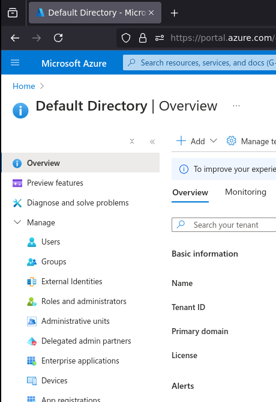

This should bring you to the 'Enterprise applications | All applications' page.

Click on 'New Application':

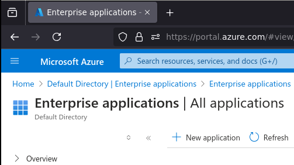

This brings you to the 'Browse Microsoft Entra Gallery' page.

Select 'Create your own application':

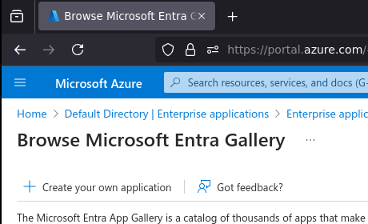

This should have opened a 'Create your own application' window in the current page.

Fill in the user-visible app name with the name for this application that you want your users to see.
Leave the option selected next to 'Integrate with any other application you don't find in the gallery', then click 'Create':

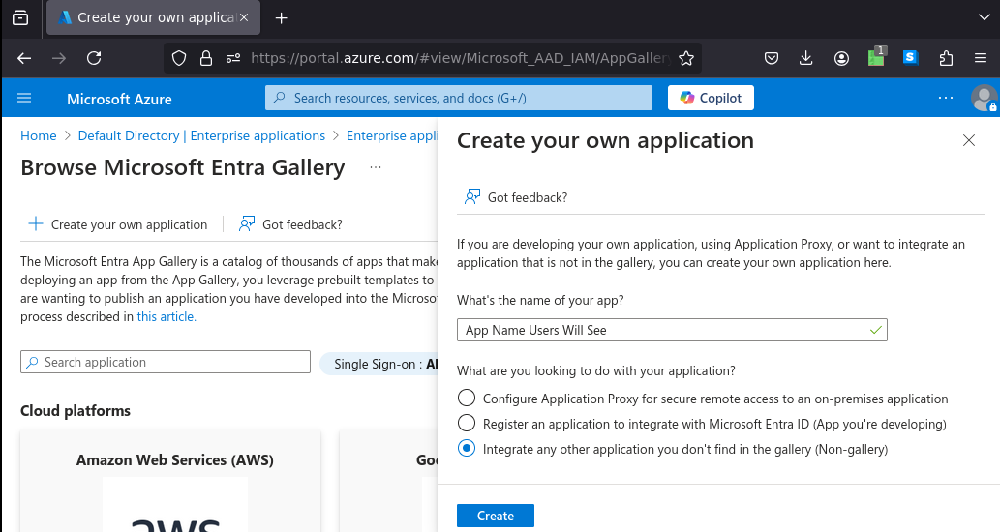

The app is now created, but is not yet configured. If you get lost, you can always get back to it by selecting its name from the 'Enterprise applications| All applications' page.

### Configuring your New Application

If you followed the prior steps, you should now be at the screen containing the settings for your application. If you didn't, please find your app by opening Azure, going to 'Microsoft Entra ID', and clicking on 'Enterprise Applications' in the left hand menu.

In the 'Getting Started' section of the page containing your application definition, Click on 'Get started' in the '2. Set up single sign on' box.

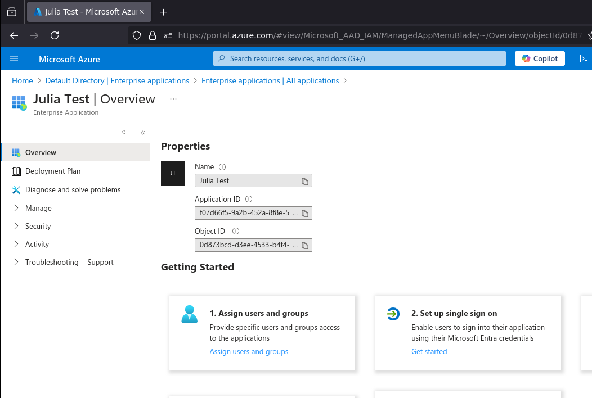

You should now see the 'Single sign-on' page for your application definition.

Click on the 'SAML' box with the puzzle piece in it.

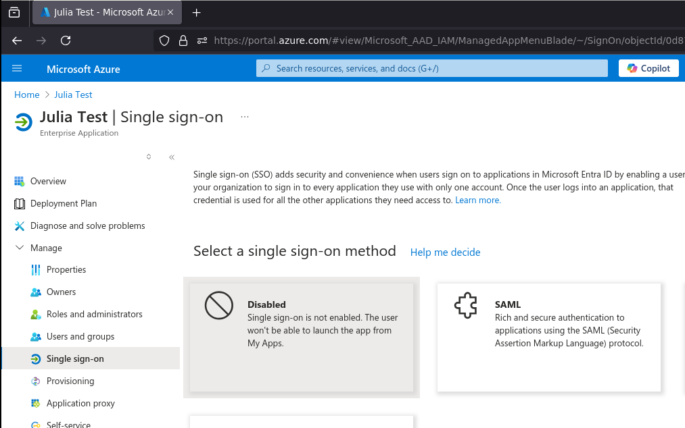

The next page is the 'SAML-based Sign-on' page for your application definition. There is a helpful configuration guide at the top of the page which you can consult if you have any Azure-specific questions.

Let's go straight to adding the two config parameters that are required, and saving.

In the 'Basic SAML Configuration' section, click on 'Edit'. This will bring up the 'Basic SAML Configuration' window.

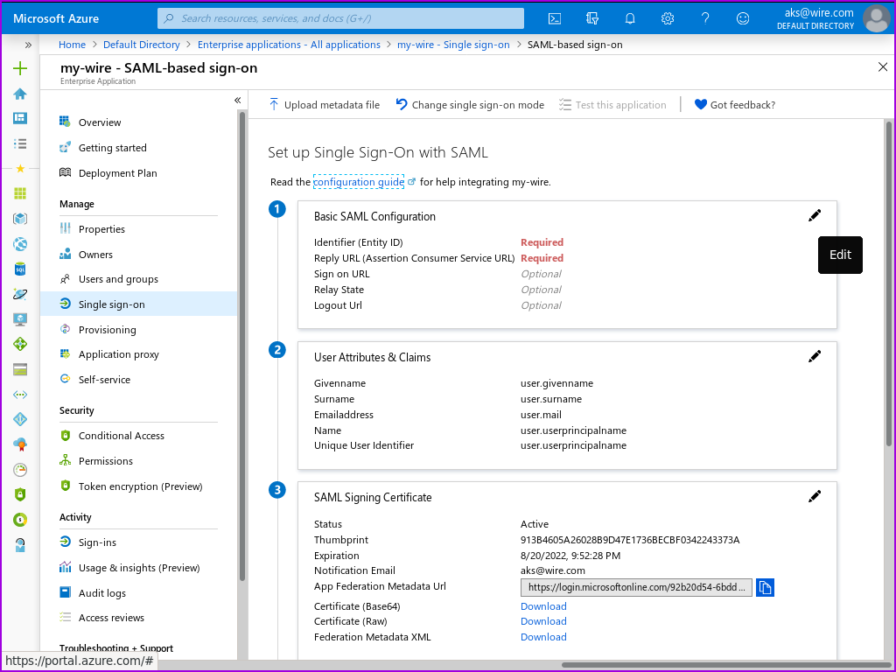

Enter <https://prod-nginz-https.wire.com/sso/finalize-login> for both 'Identifier (Entity ID)' and 'Reply URL(Assertion Consumer Service URL)':

Click on 'No, I'll test later':

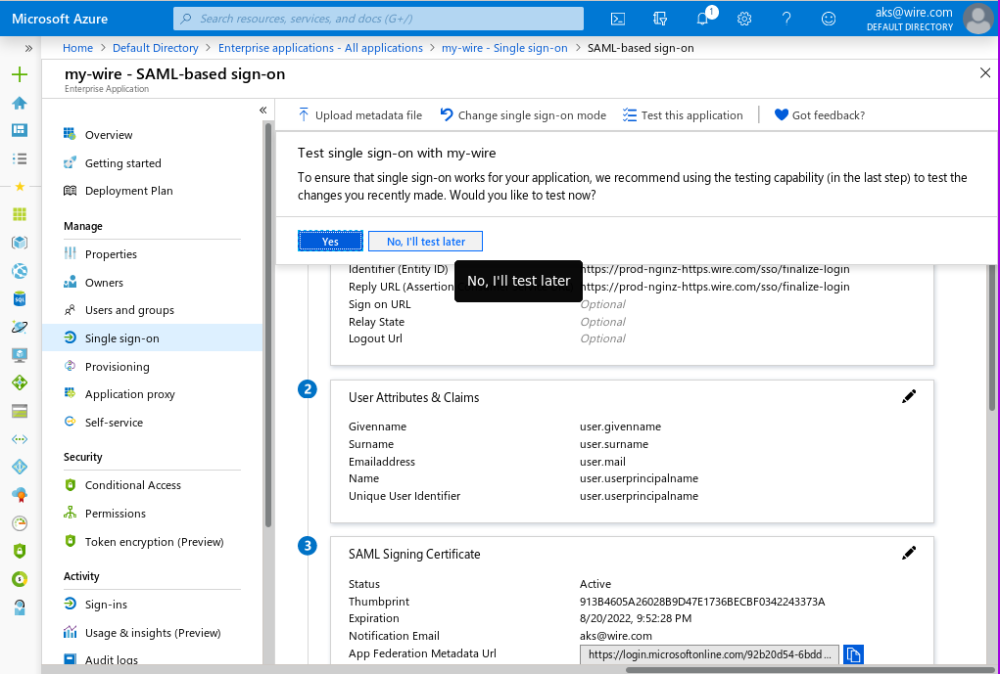

Now, you can download the 'Federation Metadata XML', which you will use in you Team Settings to make the SSO connection between Entra and Wire.

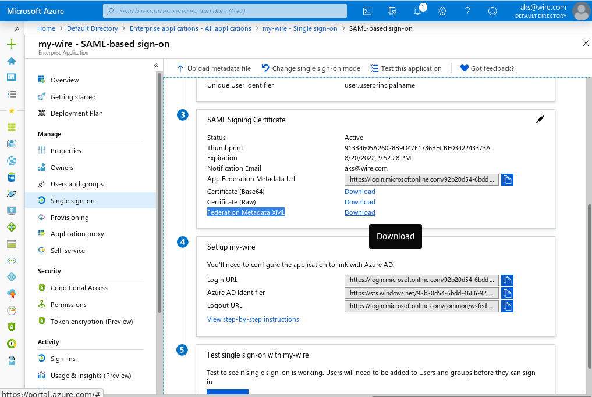

Now you can assign users to the newly created and configured application.

### Name IDs
In Single-Sign-On, a user is refered to by a 'nameID'. This is a unique identifier that must not change, identifying the user. By default, Entra ID uses the user's email address, which may change, when their name does.

It is possible to use the objectid of the user as an identifier instead, fixing this issue. To change your SSO configuration

* Click on Attributes & Claims
* There will be one 'Required claim', for the 'Unique User Identifier(NameID)'. Click on it to edit it.
* Change the Name identifier format to 'Unspecified'.
* Change the Source attribute to user.objectid.
* click on 'Save'

### Adding a user
Assuming you are still looking at your Enterprise Application:
In the left hand menu, above 'Single sign-on', you can find 'Users and groups'. Click there.

This is the page where you can add your users from your Default Domain, so that they can use SSO.

To add a user:
Click the 'Add user' icon in the top left of the screen.
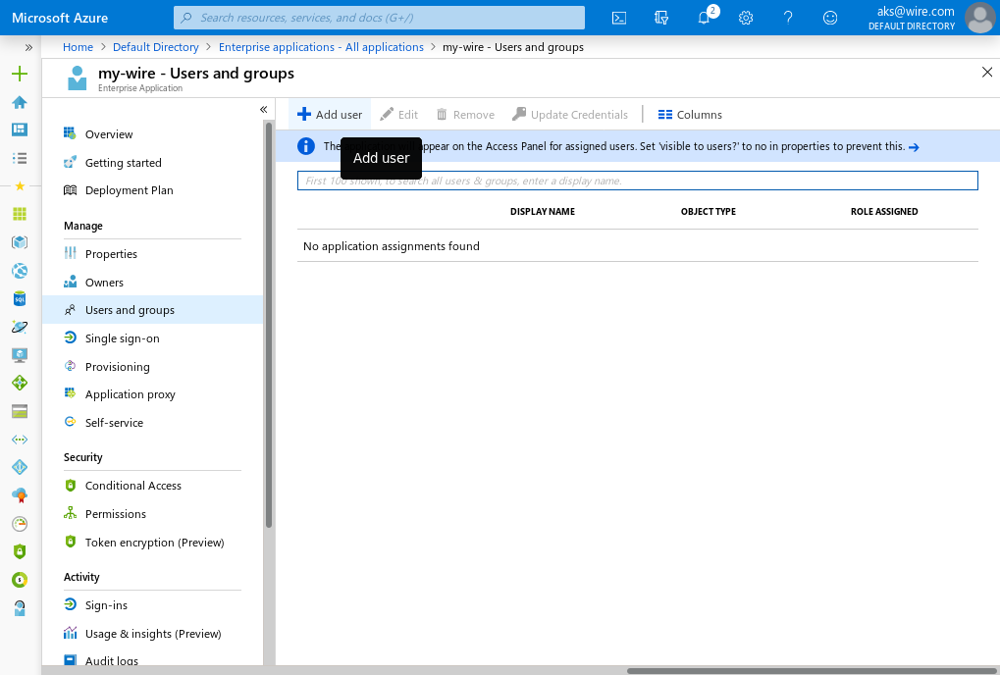

This will open an 'Add assignment' page, warning you that you cannot add groups.

Click on 'None Selected', this will open a 'Users' window.

Click the checkbox next to each user you want to login to wire.
Then click 'Select' on the bottom of the page, then 'Assign' on the 'Add assignment' page to add these users to your Enterprise Application.
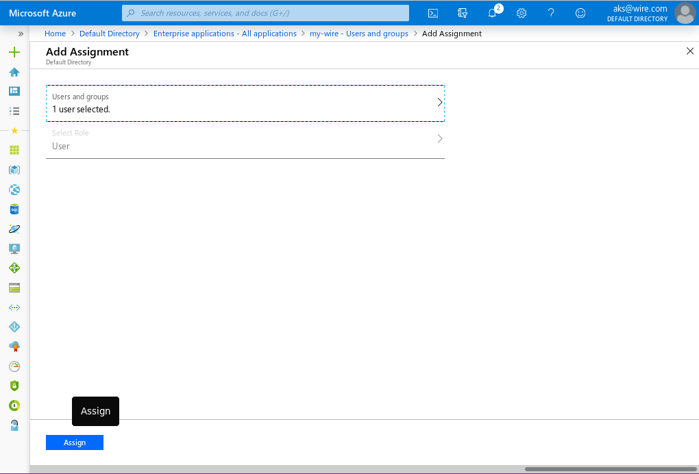

Each user you add at this point can be Ad-hoc/JIT provisioned via SSO, when they login for the first time.

If you want more control over provisioning users, you can follow the rest of this documentation on how to set up SCIM auto-provisioning.

**IMPORTANT!** If you do set up a SCIM token within Wire Team Settings for your team, Ad-hoc/JIT SSO provisioning will be disabled and the users assigned to your Enterprise Application will not be able to login untill you provision them via SCIM!

## How to set up SCIM auto-provisioning with Microsoft Entra ID

### Creating a SCIM Token in Wire

Login as an administrator to team settings. For the production cloud environment, you can find this at https://teams.wire.com/

* Select 'Customization' in the left hand menu.
* Click on the "down arrow" under Automated User Management
* Click on 'Generate Token'. This will prompt you to enter your password again, as a security measure. Click on the 'Confirm' button.
You should now see your new SCIM token. Save it, as this is the only time you will be able to see it. In case you have lost it, you can always delete the current one and create a new one.

### Creating your SCIM connection
Login to Azure, enter 'Microsoft Entra ID', select 'Enterprise applications', and select the Enterprise Application we created and added SSO to earlier.

In the left hand menu, under 'Single sign-on', you should see 'Provisioning'. Click on it.

You should now see 'Get started with application provisioning'
Select 'New configuration' or in the 'Create configuration' block, select 'Connect your application'.

You should now see a 'New Provisioning configuration' window.

For the wire production environment: 
Tennant URL: `https://prod-nginz-https.wire.com/scim/v2`
Secret Token: enter the SCIM token you created and saved earlier.

For on-prem environments, your 'Tennant URL' will be different, by default, it should be like this `https://nginz-https.your.domain/scim/v2`

Click on 'Test connection'.

You should now see a little window with a green checkmark, indicating your connection is successful.

Now click on the 'Create' button at the bottom of the screen.

This should bring you to an 'Overview' page, showing an overview of your SCIM synchronization service.

### Configuring your Mappings

Values from your users' records in Entra are sent to wire over SCIM, to provision your users. Entra configures alot of mappings by default, which are not used/relevant/supported by Wire. For `CREATE` requests, this is fine, but for continuous synchronization, any `UPDATE` or `DELETE` requests with unsupported attributes will get rejected by Wire.

Supported attributes:

* userName - user handle in Wire (account name), example @user.usersky
* displayName - user display name in Wire, example User Usersky
* externalId - user UUID, very important as this needs to remain constant for a user
* active - is the user enabled/active
* roles - user permissions in Wire team (Owner, Administrator, Member, External)

#### Adjusting the user mapping

In the left-hand collapseable menu, un-collapse 'Manage'.
You should now see an 'Attribute mapping' menu entry.
Click on 'Attribute mapping'

Microsoft Entra ID supports the synchronization of both users, and groups. We are only interested in the synchronization of users.
Click on 'Provision Microsoft Entra ID Users'

You are now in the mapping editor, for the user synchronization process. Here, you will need to remove all the unsupported mappings.
To adjust to remaining supported mappings to your preference, do the following:
Next to 'userName' (or any of the other attributes), click on 'Edit'.
Set the 'Source attribute' to the field in your directory where you place the user's globally unique handle, and click the 'OK' button at the bottom of the page.

After you are done making adjustments, make sure you click the 'Save' icon in the top left corner of the page.

### Testing your SCIM connection

Now that your mappings are set correctly, it's time to try to create your first user.

Click on 'Provision on demand' in the left hand menu.

Search for your user, click on them and hit 'Provision' at the bottom of the page.

You should see four green checkmarks if everything went well. If it didn't check the logs for useful information why.

To turn on automatic provisioning, go back to 'Overview' in the left-hand Menu, then in the top bar, click on 'Start provisioning'.

## Further reading

- technical concepts overview:
  : - <https://docs.microsoft.com/en-us/azure/active-directory/develop/active-directory-saml-protocol-reference>
  : - <https://docs.microsoft.com/en-us/azure/active-directory/develop/single-sign-on-saml-protocol>
- how to create an app:
  : - <https://docs.microsoft.com/en-us/azure/active-directory/develop/quickstart-register-app>
- how to configure SAML2.0 SSO:
  : - <https://docs.microsoft.com/en-us/azure/active-directory/manage-apps/what-is-single-sign-on#saml-sso>
  : - <https://docs.microsoft.com/en-us/azure/active-directory/manage-apps/configure-single-sign-on-non-gallery-applications>

