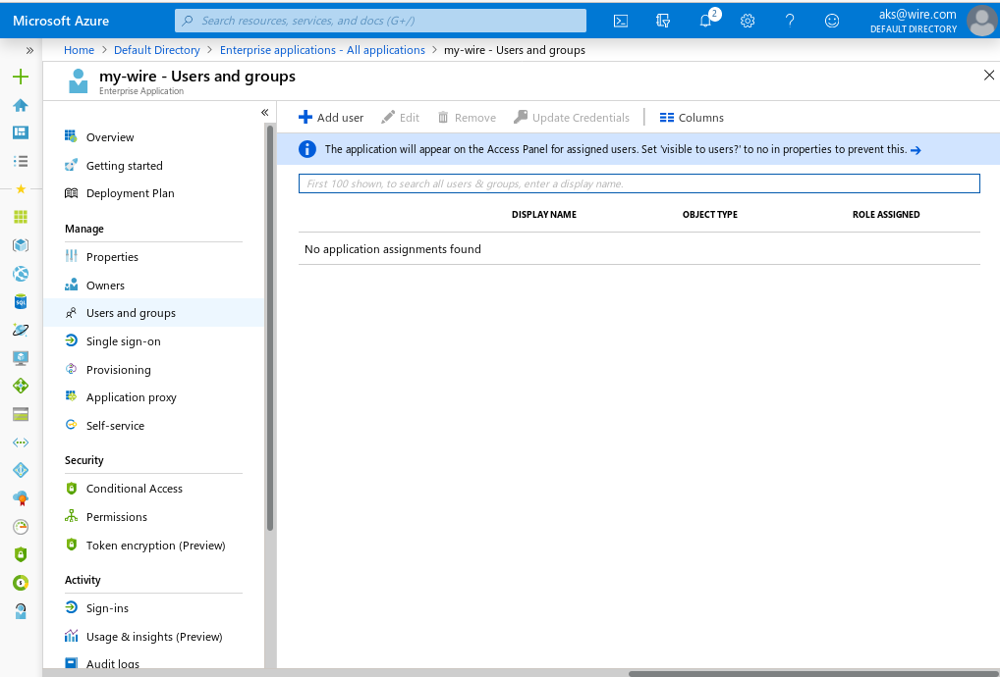
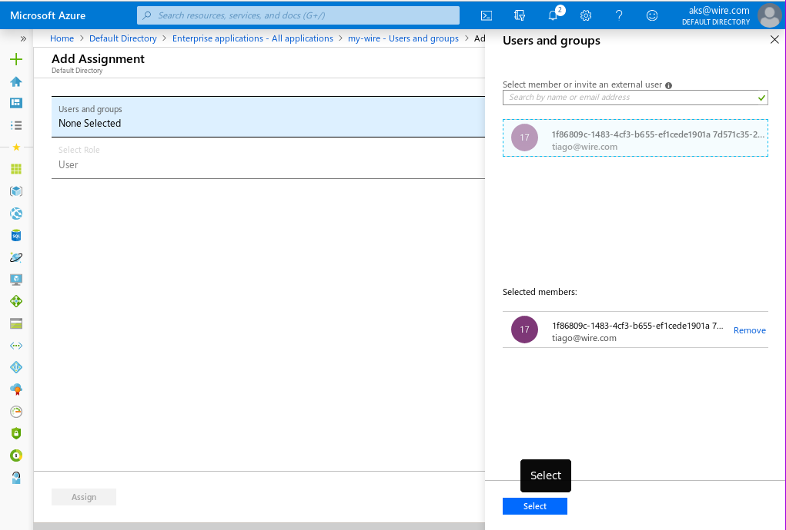
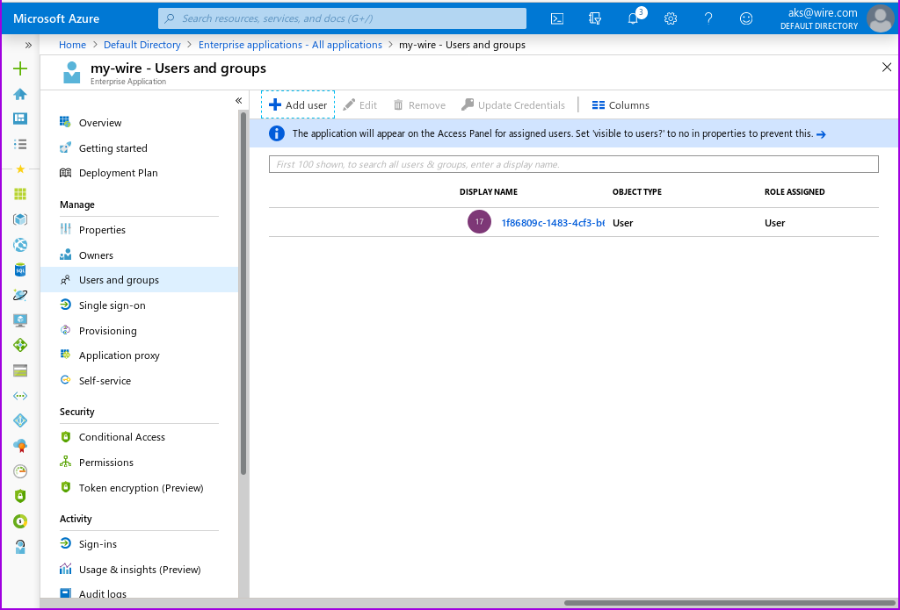

# How to set up SSO integration with Microsoft Entra ID

## Purpous and Scope
This document is for current and perspective users of the wire cloud, who want to manage their users with Microsoft Entra ID, in Azure.

## Preprequisites
Before you begin, we are going to assume you have the following:

* An account on <http://azure.microsoft.com>
    * Admin access to that account, sufficient to add an application, and manage users.
* A team on https://app.wire.com/ or another wire backend, and administrative access to that team.

## Process

### Creating a New Application

Go to <https://portal.azure.com/>, and login. You should be brought to the 'Microsoft Azure' home page.

* In the 'Azure services' section, click on 'Microsoft Entra ID':

You should now see the 'Default Directory | Overview' page.

* In the menu to your left, 'Manage' should already be expanded. Under manage, click on 'Enterprise Applications':

This should bring you to the 'Enterprise applications| All applications' page.

* Click on 'New Application':

This brings you to the 'Browse Microsoft Entra Gallery' page.

* Select 'Create your own application':

This should have opened a 'Create your own application' window in the current page.

* Fill in the user-visible app name with the name for this application that you want your users to see.
* Leave the option selected next to 'Integrate with any other application you don't find in the gallery', then click 'Create':

The app is now created, but is not yet configured. If you get lost, you can always get back to it by selecting its name from the 'Enterprise applications| All applications' page.

### Configuring your New Application

If you followed the prior step, you should now be at the screen containing the settings for your application. If you didn't, please find your app by opening azure, going to 'Microsoft Entra ID', and clicking on 'Enterprise Applications' in the left hand menu.

* In the 'Getting Started' section of the page containing your application definition, Click on 'get started' in the '2. Set up single sign on' box.

You should now see the 'Single sign-on' page for your application definition.

* Click on the 'SAML' box with the puzzle piece in it.

The next page is the 'SAML-based Sign-on' page for your application definition. There is a helpful configuration guide at the top of the page which you can consult if you have any azure-specific questions.

Let's go straight to adding the two config parameters that are required, and saving.

* In the 'Basic SAML Configuration' section, click on 'Edit'. This will bring up the 'Basic SAML Configuration' window.
	* Enter <https://prod-nginz-https.wire.com/sso/finalize-login> for both 'Identifier (Entity ID)' and 'Reply URL(Assertion Consumer Service URL)':

* Click on 'test later':

Finally, you need to assign users to the newly created and configured application:

### Name IDs
In Single-Sign-On, a user is refered to by a 'nameID'. This is a unique identifier that must not change, identifying the user. By default, Entra ID uses the user's email address, which may change, when their name does.

It is possible to use the objectid of the user as an identifier instead, fixing this issue. To change your SSO configuration

* Click on Attributes & Claims
  * There will be one 'Required claim', for the 'Unique User Identifier(NameID)'. Click on it to edit it.
    * Change the Name identifier format to 'Unspecified'.
    * Change the Source attribute to user.objectid.
    * click on 'Save'

### Grabbing your XML file
In the 'SAML-based sign-on' page for your application definition, in box 3, the last 'download' link is the XML file you need to give wire's team settings. provide that to team settings, and your done!

### Adding your users
In order for a user to login via your new SSO connection, you will need to add them to this 'Enterprise Application'.

### Adding a user
Assuming you are still looking at your Enterprise Application:

* In the left hand menu, above 'Single sign-on', you can find 'Users and groups'. Click there.

This is the page where you can add your users from your Default Domain, so that they can use SSO.

To add a user:
* Click the 'Add user/group' icon in the top left of the screen.

This will open an 'Add assignment' page, warning you that you cannot add groups.

* Click on 'None Selected'

this will open a 'Users' window.

* Click the checkbox next to each user you want to login to wire.
* Click 'Select' on the bottom of the page, then 'Assign' on the 'Add assignment' page to add these users to your Enterprise Application.

Each user you add can at this point be auto-provisioned via SSO, which works, but is not ideal.

# How to set up SCIM auto-provisioning with Microsoft Entra ID

After the above setup, you will have Single-Sign-On for all of the users you add to this application. This will come with auto-provisioning, which uses the details from Entra ID to create a wire account automatically, after the user logs in.

By default, this does not contain a "easy to read" display name. If you are using objectid as NameID (as we did above in the Name IDs section), you will have your users prompted to select their display name upon logging in... and wire will pre-populate your user's display name field with the uuid.

To fix this, We are going to configure Entra ID to configure your users in wire ahead of time, using the SCIM protocol.

## Creating a SCIM Token in Wire
First, you need to go to team settings, create a SCIM token, and save it somewhere safe.

* Login as an administrator to team settings. For the production cloud environment, you can find this at https://teams.wire.com/

* select 'Customization' in the left hand menu.
* click on the "down arrow" under Automated User Management
* Click on 'Generate Token'. This will prompt you to enter your password again, as a security measure. Click on the 'Confirm' button.
* You should now see your new scim token. Place it somewhere safe, and close team settings.

## Configuring Microsoft Entra ID to use SCIM

### Creating your SCIM connection
Login to Azure, enter 'Microsoft Entra ID', select 'Enterprise applications', and select the Enterprise Application we created and added SSO to earlier.

* In the left hand menu, under 'Single sign-on', you can see a 'Provisioning'. select it.

You should now see 'Get started with application provisioning'

* Select 'create your connection', in the 'Create configuration' block.

You should now see a 'New Provisioning configuration' window.

* For the wire production environment: 
  * For the 'Tennant URL',  enter `https://prod-nginz-https.wire.com/scim/v2`. This is where Entra ID will talk to the wire backend.
  * For the 'Secret Token', enter the SCIM token you created earlier.

* Click on 'Test connection'.

You should now see a little window with a green checkmark, indicating your connection is successful.

* Click on the 'Create' button at the bottom of the screen.

This should bring you to an 'Overview' page, showing an overview of your SCIM synchronization service.

### Configuring your Mappings

Values from your users' records in Entra are sent to wire over SCIM, to set up your users. You get to select which of these values to send, but there is a default mapping, which for wire, is incorrect.

We are going to change three mappings: displayName, userName, and externalId. In wire, DisplayName is the name others see you as, where userName is a unique name, that others can @ refer to you as. externalId needs to be changed, in order for SCIM and SSO to use the same identifier to reffer to users by. This is required because we changed the identifier from E-Mail to UUID in the SSO configuration above.

#### Adjusting the user mapping

* In the left-hand collapseable menu, un-collapse 'Manage'.

You should now see an 'Attribute mapping' menu entry.

* Click on 'Attribute mapping'

Microsoft Entra ID supports the synchronization of both users, and groups. We are only interested in the synchronization of users.

* Click on 'Provision Microsoft Entra ID Users'

You are now in the mapping editor, for the user synchronization process. Here, you need to change two values: userName, and displayName

* Next to 'userName', Click on 'Edit'.

You are now editing the mapping for the userName. 

* Set the 'Source attribute' to the field in your directory where you place the user's globally unique handle, and click the 'OK' button at the bottom of the page.

* Next to 'displayName', Click on 'Edit'.

You are now editing the mapping for the displayName. 

* Set the 'Source attribute' to the fieldin your directory where you place the user's display name, and click the 'OK' button at the bottom of the page.

* Next to 'externalId', Click on 'Edit'.

You are now editing the mapping for the externalId that SSO and Wire agree on.

* Select the 'objectId' field to match the value we placed in the SSO configuration, and click the 'OK' button at the bottom of the page.

Make sure you click the 'Save' icon in the top left corner of the page. After that, navigate back to the 'Overview' of this application, by clicking on 'Enterprise Applications| All applications' in near the top of the page.

### Testing your SCIM connection

Now that your mappings are set correctly, it's time to try to create your first user.

Pick a user that you have added to the enterprise application, that has entries in the fields you chose for userName and displayName.

Click on 'Provision on demand' in the left hand menu.

search for your user, click on them, and hit 'Provision' at the bottom of the page.

You should see four green checkmarks if all went well. Reset this user's password (if necessary), and login via SSO. you should not be prompted to provide a handle, and both your handle and displayName should be what you saw in the database.

## Further reading

- technical concepts overview:
  : - <https://docs.microsoft.com/en-us/azure/active-directory/develop/active-directory-saml-protocol-reference>
    - <https://docs.microsoft.com/en-us/azure/active-directory/develop/single-sign-on-saml-protocol>
- how to create an app:
  : - <https://docs.microsoft.com/en-us/azure/active-directory/develop/quickstart-register-app>
- how to configure SAML2.0 SSO:
  : - <https://docs.microsoft.com/en-us/azure/active-directory/manage-apps/what-is-single-sign-on#saml-sso>
    - <https://docs.microsoft.com/en-us/azure/active-directory/manage-apps/configure-single-sign-on-non-gallery-applications>

